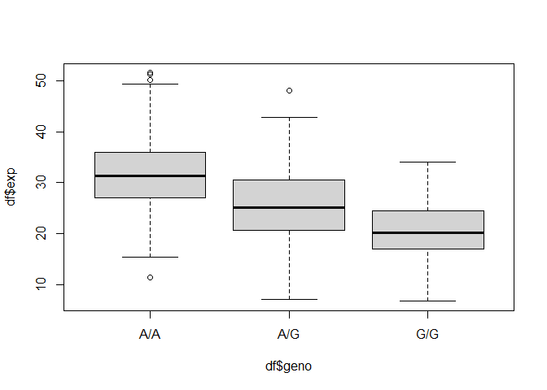

# Class 12
David Majeed (A17885958)

``` r
#Section 1. Protion of G/G in Population 
mxl<-read.csv("373531-SampleGenotypes-Homo_sapiens_Variation_Sample_rs8067378.csv")
head(mxl)
```

      Sample..Male.Female.Unknown. Genotype..forward.strand. Population.s. Father
    1                  NA19648 (F)                       A|A ALL, AMR, MXL      -
    2                  NA19649 (M)                       G|G ALL, AMR, MXL      -
    3                  NA19651 (F)                       A|A ALL, AMR, MXL      -
    4                  NA19652 (M)                       G|G ALL, AMR, MXL      -
    5                  NA19654 (F)                       G|G ALL, AMR, MXL      -
    6                  NA19655 (M)                       A|G ALL, AMR, MXL      -
      Mother
    1      -
    2      -
    3      -
    4      -
    5      -
    6      -

``` r
table(mxl$Genotype..forward.strand.)/nrow(mxl)
```


         A|A      A|G      G|A      G|G 
    0.343750 0.328125 0.187500 0.140625 

Section 4

Q.13 +14

``` r
expr<-read.table("rs8067378_ENSG00000172057.6.txt")
#Lets import our data
head(expr)
```

       sample geno      exp
    1 HG00367  A/G 28.96038
    2 NA20768  A/G 20.24449
    3 HG00361  A/A 31.32628
    4 HG00135  A/A 34.11169
    5 NA18870  G/G 18.25141
    6 NA11993  A/A 32.89721

``` r
nrow(expr)
```

    [1] 462

``` r
table(expr$geno)
```


    A/A A/G G/G 
    108 233 121 

``` r
#Lets get some basic understanding of our data by looking at the header, number of rows, and the table of genotypes
df<- data.frame(expr)

#To further examine, lets get our data into a data frame

bp_out<-boxplot(df$exp ~ df$geno, data=df)
```



``` r
#Lets use the boxplot function on our data frame to get some stats like the median. It will out put it on the third row

bp_out$stats
```

             [,1]     [,2]     [,3]
    [1,] 15.42908  7.07505  6.67482
    [2,] 26.95022 20.62572 16.90256
    [3,] 31.24847 25.06486 20.07363
    [4,] 35.95503 30.55183 24.45672
    [5,] 49.39612 42.75662 33.95602

``` r
#Q.13 There are 108 A/A,233 A/G, and 121 G/G. The medians, respectively are, 31.25, 25.06, and 20.07


library(ggplot2)
#Load up ggplot
ggplot(expr)+ 
#ggplot allows us to use the plot function with (expr) highligting the use of the expr data  
  aes(geno, exp, fill=geno)+
  #aes helps us deterimine the x and y axis as the genotype and expression levels. fill=geno allows us to color cordinate them
  geom_boxplot(notch = T)
```


``` r
#geom_boxplot allows us to specify that we are making a box plot graph and notch gives it the skinny effect in the middle

#Q.14 From the boxplot we see that homozygous A has higher expresion levels in comparison to homozygous G. So we can infer that the SNP does effect the expression of ORMDL3
```
