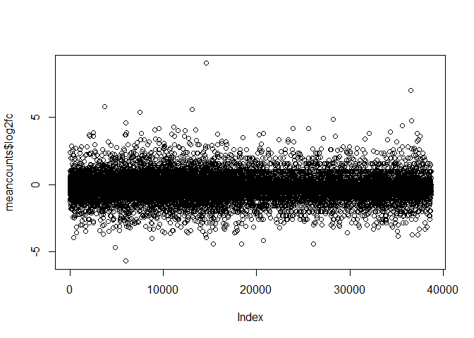
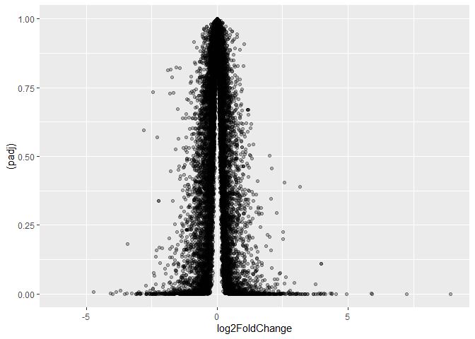
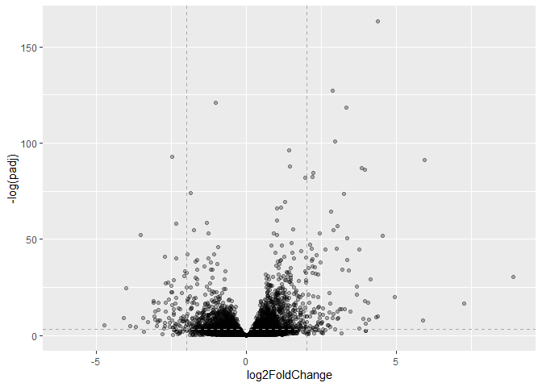
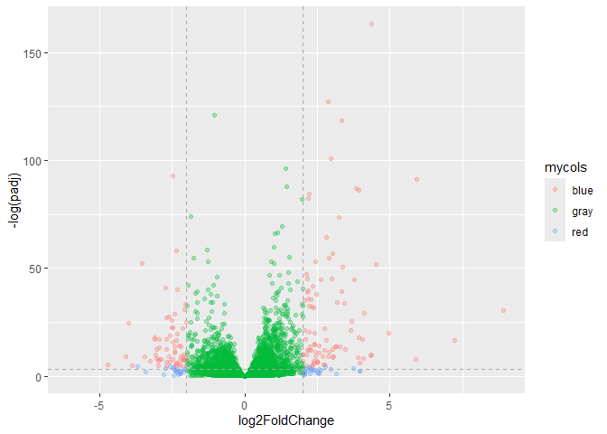
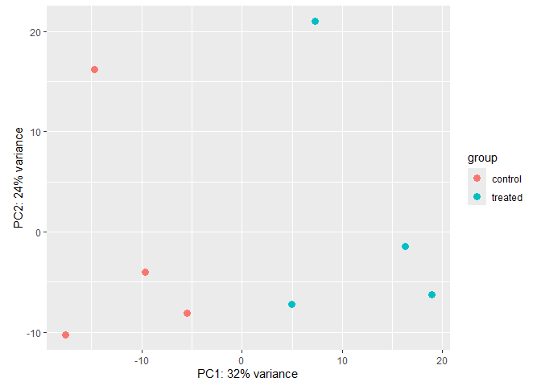
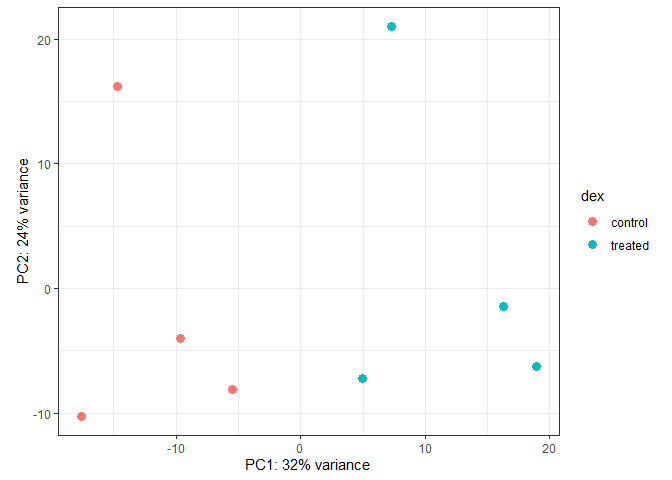

# Class 13
David Majeed(A17885958)

- [Setup](#setup)
- [Data Import](#data-import)
- [Toy Differential Gene Expression](#toy-differential-gene-expression)
- [DESeq Analysis](#deseq-analysis)
- [Volcano Plot](#volcano-plot)
- [PCA](#pca)
- [DSEQ](#dseq)
- [**Pathway analysis with R and
  Bioconductor**](#pathway-analysis-with-r-and-bioconductor)

## Setup

``` r
#install.packages("BiocManager")
#BiocManager::install()
# For this class we will need DESeq2:
#BiocManager::install("DESeq2")
library(BiocManager)
```

    Bioconductor version '3.22' is out-of-date; the current release version '3.23'
      is available with R version '4.6'; see https://bioconductor.org/install

``` r
library(DESeq2)
```

    Loading required package: S4Vectors

    Loading required package: stats4

    Loading required package: BiocGenerics

    Loading required package: generics


    Attaching package: 'generics'

    The following objects are masked from 'package:base':

        as.difftime, as.factor, as.ordered, intersect, is.element, setdiff,
        setequal, union


    Attaching package: 'BiocGenerics'

    The following objects are masked from 'package:stats':

        IQR, mad, sd, var, xtabs

    The following objects are masked from 'package:base':

        anyDuplicated, aperm, append, as.data.frame, basename, cbind,
        colnames, dirname, do.call, duplicated, eval, evalq, Filter, Find,
        get, grep, grepl, is.unsorted, lapply, Map, mapply, match, mget,
        order, paste, pmax, pmax.int, pmin, pmin.int, Position, rank,
        rbind, Reduce, rownames, sapply, saveRDS, table, tapply, unique,
        unsplit, which.max, which.min


    Attaching package: 'S4Vectors'

    The following object is masked from 'package:utils':

        findMatches

    The following objects are masked from 'package:base':

        expand.grid, I, unname

    Loading required package: IRanges


    Attaching package: 'IRanges'

    The following object is masked from 'package:grDevices':

        windows

    Loading required package: GenomicRanges

    Loading required package: Seqinfo

    Loading required package: SummarizedExperiment

    Loading required package: MatrixGenerics

    Loading required package: matrixStats


    Attaching package: 'MatrixGenerics'

    The following objects are masked from 'package:matrixStats':

        colAlls, colAnyNAs, colAnys, colAvgsPerRowSet, colCollapse,
        colCounts, colCummaxs, colCummins, colCumprods, colCumsums,
        colDiffs, colIQRDiffs, colIQRs, colLogSumExps, colMadDiffs,
        colMads, colMaxs, colMeans2, colMedians, colMins, colOrderStats,
        colProds, colQuantiles, colRanges, colRanks, colSdDiffs, colSds,
        colSums2, colTabulates, colVarDiffs, colVars, colWeightedMads,
        colWeightedMeans, colWeightedMedians, colWeightedSds,
        colWeightedVars, rowAlls, rowAnyNAs, rowAnys, rowAvgsPerColSet,
        rowCollapse, rowCounts, rowCummaxs, rowCummins, rowCumprods,
        rowCumsums, rowDiffs, rowIQRDiffs, rowIQRs, rowLogSumExps,
        rowMadDiffs, rowMads, rowMaxs, rowMeans2, rowMedians, rowMins,
        rowOrderStats, rowProds, rowQuantiles, rowRanges, rowRanks,
        rowSdDiffs, rowSds, rowSums2, rowTabulates, rowVarDiffs, rowVars,
        rowWeightedMads, rowWeightedMeans, rowWeightedMedians,
        rowWeightedSds, rowWeightedVars

    Loading required package: Biobase

    Welcome to Bioconductor

        Vignettes contain introductory material; view with
        'browseVignettes()'. To cite Bioconductor, see
        'citation("Biobase")', and for packages 'citation("pkgname")'.


    Attaching package: 'Biobase'

    The following object is masked from 'package:MatrixGenerics':

        rowMedians

    The following objects are masked from 'package:matrixStats':

        anyMissing, rowMedians

## Data Import

``` r
counts <- read.csv("airway_scaledcounts.csv", row.names=1)
metadata <-  read.csv("airway_metadata.csv")
head(counts)
```

                    SRR1039508 SRR1039509 SRR1039512 SRR1039513 SRR1039516
    ENSG00000000003        723        486        904        445       1170
    ENSG00000000005          0          0          0          0          0
    ENSG00000000419        467        523        616        371        582
    ENSG00000000457        347        258        364        237        318
    ENSG00000000460         96         81         73         66        118
    ENSG00000000938          0          0          1          0          2
                    SRR1039517 SRR1039520 SRR1039521
    ENSG00000000003       1097        806        604
    ENSG00000000005          0          0          0
    ENSG00000000419        781        417        509
    ENSG00000000457        447        330        324
    ENSG00000000460         94        102         74
    ENSG00000000938          0          0          0

``` r
head(metadata)
```

              id     dex celltype     geo_id
    1 SRR1039508 control   N61311 GSM1275862
    2 SRR1039509 treated   N61311 GSM1275863
    3 SRR1039512 control  N052611 GSM1275866
    4 SRR1039513 treated  N052611 GSM1275867
    5 SRR1039516 control  N080611 GSM1275870
    6 SRR1039517 treated  N080611 GSM1275871

``` r
View(counts)
#Q1 There are 38694 genes in the data

table(metadata$dex)
```


    control treated 
          4       4 

``` r
#Q2 There are 4 controls
```

## Toy Differential Gene Expression

``` r
control <- metadata[metadata[,"dex"]=="control",]
control.counts <- counts[ ,control$id]
control.mean <- rowSums( control.counts )/4 
head(control.mean)
```

    ENSG00000000003 ENSG00000000005 ENSG00000000419 ENSG00000000457 ENSG00000000460 
             900.75            0.00          520.50          339.75           97.25 
    ENSG00000000938 
               0.75 

``` r
#find the control column
control.inds<-metadata$dex =="control"
#extract out the values in counts
control.counts<- counts[,control.inds]
#find the average
control.mean<- rowMeans(control.counts)


#Q.3 The function rowSums() can help the code
#same thing for treated

treated.inds<- metadata$dex=="treated"
treated.counts<- counts[,treated.inds]
treated.mean<- rowMeans(treated.counts)
#Q.4 The code above does the same with treated
#lets stores these together
library(dplyr)
```


    Attaching package: 'dplyr'

    The following object is masked from 'package:Biobase':

        combine

    The following object is masked from 'package:matrixStats':

        count

    The following objects are masked from 'package:GenomicRanges':

        intersect, setdiff, union

    The following object is masked from 'package:Seqinfo':

        intersect

    The following objects are masked from 'package:IRanges':

        collapse, desc, intersect, setdiff, slice, union

    The following objects are masked from 'package:S4Vectors':

        first, intersect, rename, setdiff, setequal, union

    The following objects are masked from 'package:BiocGenerics':

        combine, intersect, setdiff, setequal, union

    The following object is masked from 'package:generics':

        explain

    The following objects are masked from 'package:stats':

        filter, lag

    The following objects are masked from 'package:base':

        intersect, setdiff, setequal, union

``` r
meancounts<-data.frame(control.mean,treated.mean)
#lets plot it 
#Q5.a
plot(control.mean, treated.mean)
```


``` r
plot(meancounts)
```


``` r
#Q5.b You would use geom_point() function if you used ggplot
head(meancounts)
```

                    control.mean treated.mean
    ENSG00000000003       900.75       658.00
    ENSG00000000005         0.00         0.00
    ENSG00000000419       520.50       546.00
    ENSG00000000457       339.75       316.50
    ENSG00000000460        97.25        78.75
    ENSG00000000938         0.75         0.00

Our count data is highly skewed as seen in the plot, thus we need to
transform it with a log

``` r
#Q.6 You would use log="xy" for the argument to transform them to the log scale
plot(meancounts, log="xy")
```

    Warning in xy.coords(x, y, xlabel, ylabel, log): 15032 x values <= 0 omitted
    from logarithmic plot

    Warning in xy.coords(x, y, xlabel, ylabel, log): 15281 y values <= 0 omitted
    from logarithmic plot


``` r
#Lets use log^2 to transform this data because it makes the interpertation easier, its the log2 fold change

meancounts$log2fc<- log2(meancounts$treated.mean/meancounts$control.mean)
plot(meancounts$log2fc)
```



``` r
zero.vals <- which(meancounts[,1:2]==0, arr.ind=TRUE)

to.rm <- unique(zero.vals[,1])
mycounts <- meancounts[-to.rm,]
head(mycounts)
```

                    control.mean treated.mean      log2fc
    ENSG00000000003       900.75       658.00 -0.45303916
    ENSG00000000419       520.50       546.00  0.06900279
    ENSG00000000457       339.75       316.50 -0.10226805
    ENSG00000000460        97.25        78.75 -0.30441833
    ENSG00000000971      5219.00      6687.50  0.35769358
    ENSG00000001036      2327.00      1785.75 -0.38194109

``` r
#Q.7 It retrieves the positions of all the true values. 
#We use the unique function to prevent double counting 
#and ensuring our data stays clean. 

up.ind <- mycounts$log2fc > 2
down.ind <- mycounts$log2fc < (-2)
sum(up.ind)
```

    [1] 250

``` r
#Q.8 We have 250 up regulated genes above 2 fc
sum(down.ind)
```

    [1] 367

``` r
#Q.9 We have 367 down regluated genes above 2 fc
#Q.10 We need to still be a bit skeptical and need to preform a DESeq analysis to really enusre that our results have p-values that are significant
```

## DESeq Analysis

Lets find significance

``` r
library(DESeq2)
```

2 inputs needed for DESeq: countData and colData

``` r
dds<- DESeqDataSetFromMatrix(countData = counts,
                             colData = metadata,
                             design = ~dex)
```

    converting counts to integer mode

Now we can run the DESeq analysis pipeline using dds object

``` r
dds<- DESeq(dds)
```

    estimating size factors

    estimating dispersions

    gene-wise dispersion estimates

    mean-dispersion relationship

    final dispersion estimates

    fitting model and testing

``` r
res<- results(dds)
head(res)
```

    log2 fold change (MLE): dex treated vs control 
    Wald test p-value: dex treated vs control 
    DataFrame with 6 rows and 6 columns
                      baseMean log2FoldChange     lfcSE      stat    pvalue
                     <numeric>      <numeric> <numeric> <numeric> <numeric>
    ENSG00000000003 747.194195     -0.3507030  0.168246 -2.084470 0.0371175
    ENSG00000000005   0.000000             NA        NA        NA        NA
    ENSG00000000419 520.134160      0.2061078  0.101059  2.039475 0.0414026
    ENSG00000000457 322.664844      0.0245269  0.145145  0.168982 0.8658106
    ENSG00000000460  87.682625     -0.1471420  0.257007 -0.572521 0.5669691
    ENSG00000000938   0.319167     -1.7322890  3.493601 -0.495846 0.6200029
                         padj
                    <numeric>
    ENSG00000000003  0.163035
    ENSG00000000005        NA
    ENSG00000000419  0.176032
    ENSG00000000457  0.961694
    ENSG00000000460  0.815849
    ENSG00000000938        NA

## Volcano Plot

Puts together the log fold change and the pvalue into one plot and
visualization

``` r
library(ggplot2)
ggplot(res)+
  aes(log2FoldChange, (padj)) +
  geom_point(alpha=0.3)
```

    Warning: Removed 23549 rows containing missing values or values outside the scale range
    (`geom_point()`).



``` r
#Lets log it
ggplot(res)+
  aes(log2FoldChange, log(padj)) +
  geom_point(alpha=0.3)
```

    Warning: Removed 23549 rows containing missing values or values outside the scale range
    (`geom_point()`).


``` r
#lets flip it
ggplot(res)+
  aes(log2FoldChange, -log(padj)) +
  geom_point(alpha=0.3)
```

    Warning: Removed 23549 rows containing missing values or values outside the scale range
    (`geom_point()`).


``` r
#lets add some thresholds
ggplot(res)+
  aes(log2FoldChange, -log(padj)) +
  geom_point(alpha=0.3)+
  geom_hline(yintercept=-log(0.05), col="darkgray", lty=2)+
  geom_vline(xintercept=2, col="darkgray", lty=2)+
    geom_vline(xintercept=-2, col="darkgray", lty=2)
```

    Warning: Removed 23549 rows containing missing values or values outside the scale range
    (`geom_point()`).



``` r
#lets add some color
mycols <- rep("gray", nrow(res))
mycols[ abs(res$log2FoldChange) > 2 ]  <- "red" 

inds <- (res$padj < 0.01) & (abs(res$log2FoldChange) > 2 )
mycols[ inds ] <- "blue"

ggplot(res)+
  aes(log2FoldChange, -log(padj), col=mycols) +
  geom_point(alpha=0.3)+
  geom_hline(yintercept=-log(0.05), col="darkgray", lty=2)+
  geom_vline(xintercept=2, col="darkgray", lty=2)+
    geom_vline(xintercept=-2, col="darkgray", lty=2)
```

    Warning: Removed 23549 rows containing missing values or values outside the scale range
    (`geom_point()`).



``` r
write.csv(res, file="myresults.csv")
```

``` r
library(DESeq2)
citation("DESeq2")
```

    To cite package 'DESeq2' in publications use:

      Love, M.I., Huber, W., Anders, S. Moderated estimation of fold change
      and dispersion for RNA-seq data with DESeq2 Genome Biology 15(12):550
      (2014)

    A BibTeX entry for LaTeX users is

      @Article{,
        title = {Moderated estimation of fold change and dispersion for RNA-seq data with DESeq2},
        author = {Michael I. Love and Wolfgang Huber and Simon Anders},
        year = {2014},
        journal = {Genome Biology},
        doi = {10.1186/s13059-014-0550-8},
        volume = {15},
        issue = {12},
        pages = {550},
      }

``` r
dds <- DESeqDataSetFromMatrix(countData=counts, 
                              colData=metadata, 
                              design=~dex)
```

    converting counts to integer mode

    Warning in DESeqDataSet(se, design = design, ignoreRank): some variables in
    design formula are characters, converting to factors

``` r
dds
```

    class: DESeqDataSet 
    dim: 38694 8 
    metadata(1): version
    assays(1): counts
    rownames(38694): ENSG00000000003 ENSG00000000005 ... ENSG00000283120
      ENSG00000283123
    rowData names(0):
    colnames(8): SRR1039508 SRR1039509 ... SRR1039520 SRR1039521
    colData names(4): id dex celltype geo_id

## PCA

``` r
vsd <- vst(dds, blind = FALSE)
plotPCA(vsd, intgroup = c("dex"))
```

    using ntop=500 top features by variance



``` r
pcaData <- plotPCA(vsd, intgroup=c("dex"), returnData=TRUE)
```

    using ntop=500 top features by variance

``` r
head(pcaData)
```

                      PC1        PC2   group       name         id     dex celltype
    SRR1039508 -17.607922 -10.225252 control SRR1039508 SRR1039508 control   N61311
    SRR1039509   4.996738  -7.238117 treated SRR1039509 SRR1039509 treated   N61311
    SRR1039512  -5.474456  -8.113993 control SRR1039512 SRR1039512 control  N052611
    SRR1039513  18.912974  -6.226041 treated SRR1039513 SRR1039513 treated  N052611
    SRR1039516 -14.729173  16.252000 control SRR1039516 SRR1039516 control  N080611
    SRR1039517   7.279863  21.008034 treated SRR1039517 SRR1039517 treated  N080611
                   geo_id sizeFactor
    SRR1039508 GSM1275862  1.0193796
    SRR1039509 GSM1275863  0.9005653
    SRR1039512 GSM1275866  1.1784239
    SRR1039513 GSM1275867  0.6709854
    SRR1039516 GSM1275870  1.1731984
    SRR1039517 GSM1275871  1.3929361

``` r
# Calculate percent variance per PC for the plot axis labels
percentVar <- round(100 * attr(pcaData, "percentVar"))
ggplot(pcaData) +
  aes(x = PC1, y = PC2, color = dex) +
  geom_point(size =3) +
  xlab(paste0("PC1: ", percentVar[1], "% variance")) +
  ylab(paste0("PC2: ", percentVar[2], "% variance")) +
  coord_fixed() +
  theme_bw()
```



## DSEQ

``` r
#Use the DESeq function 
dds <- DESeq(dds)
```

    estimating size factors

    estimating dispersions

    gene-wise dispersion estimates

    mean-dispersion relationship

    final dispersion estimates

    fitting model and testing

``` r
res <- results(dds)
res
```

    log2 fold change (MLE): dex treated vs control 
    Wald test p-value: dex treated vs control 
    DataFrame with 38694 rows and 6 columns
                     baseMean log2FoldChange     lfcSE      stat    pvalue
                    <numeric>      <numeric> <numeric> <numeric> <numeric>
    ENSG00000000003  747.1942     -0.3507030  0.168246 -2.084470 0.0371175
    ENSG00000000005    0.0000             NA        NA        NA        NA
    ENSG00000000419  520.1342      0.2061078  0.101059  2.039475 0.0414026
    ENSG00000000457  322.6648      0.0245269  0.145145  0.168982 0.8658106
    ENSG00000000460   87.6826     -0.1471420  0.257007 -0.572521 0.5669691
    ...                   ...            ...       ...       ...       ...
    ENSG00000283115  0.000000             NA        NA        NA        NA
    ENSG00000283116  0.000000             NA        NA        NA        NA
    ENSG00000283119  0.000000             NA        NA        NA        NA
    ENSG00000283120  0.974916      -0.668258   1.69456 -0.394354  0.693319
    ENSG00000283123  0.000000             NA        NA        NA        NA
                         padj
                    <numeric>
    ENSG00000000003  0.163035
    ENSG00000000005        NA
    ENSG00000000419  0.176032
    ENSG00000000457  0.961694
    ENSG00000000460  0.815849
    ...                   ...
    ENSG00000283115        NA
    ENSG00000283116        NA
    ENSG00000283119        NA
    ENSG00000283120        NA
    ENSG00000283123        NA

``` r
summary(res)
```


    out of 25258 with nonzero total read count
    adjusted p-value < 0.1
    LFC > 0 (up)       : 1563, 6.2%
    LFC < 0 (down)     : 1188, 4.7%
    outliers [1]       : 142, 0.56%
    low counts [2]     : 9971, 39%
    (mean count < 10)
    [1] see 'cooksCutoff' argument of ?results
    [2] see 'independentFiltering' argument of ?results

``` r
res05 <- results(dds, alpha=0.05)
summary(res05)
```


    out of 25258 with nonzero total read count
    adjusted p-value < 0.05
    LFC > 0 (up)       : 1236, 4.9%
    LFC < 0 (down)     : 933, 3.7%
    outliers [1]       : 142, 0.56%
    low counts [2]     : 9033, 36%
    (mean count < 6)
    [1] see 'cooksCutoff' argument of ?results
    [2] see 'independentFiltering' argument of ?results

``` r
library("AnnotationDbi")
```


    Attaching package: 'AnnotationDbi'

    The following object is masked from 'package:dplyr':

        select

``` r
library("org.Hs.eg.db")
```

``` r
columns(org.Hs.eg.db)
```

     [1] "ACCNUM"       "ALIAS"        "ENSEMBL"      "ENSEMBLPROT"  "ENSEMBLTRANS"
     [6] "ENTREZID"     "ENZYME"       "EVIDENCE"     "EVIDENCEALL"  "GENENAME"    
    [11] "GENETYPE"     "GO"           "GOALL"        "IPI"          "MAP"         
    [16] "OMIM"         "ONTOLOGY"     "ONTOLOGYALL"  "PATH"         "PFAM"        
    [21] "PMID"         "PROSITE"      "REFSEQ"       "SYMBOL"       "UCSCKG"      
    [26] "UNIPROT"     

``` r
res$symbol <- mapIds(org.Hs.eg.db,
                     keys=row.names(res), # Our genenames
                     keytype="ENSEMBL",        # The format of our genenames
                     column="SYMBOL",          # The new format we want to add
                     multiVals="first")
```

    'select()' returned 1:many mapping between keys and columns

``` r
res$entrez <- mapIds(org.Hs.eg.db,
                     keys=row.names(res) , 
                     column="ENTREZID",        
                     keytype = "ENSEMBL",          
                     multiVals="first")
```

    'select()' returned 1:many mapping between keys and columns

``` r
res$uniprot<- mapIds(org.Hs.eg.db,
                     keys=row.names(res), 
                     column="UNIPROT",        
                     keytype="ENSEMBL",          
                     multiVals="first")
```

    'select()' returned 1:many mapping between keys and columns

``` r
res$genename <- mapIds(org.Hs.eg.db,
                     keys=row.names(res), 
                     column="GENENAME",        
                     keytype="ENSEMBL",          
                     multiVals="first")
```

    'select()' returned 1:many mapping between keys and columns

``` r
#Q.11 Above code
head(res)
```

    log2 fold change (MLE): dex treated vs control 
    Wald test p-value: dex treated vs control 
    DataFrame with 6 rows and 10 columns
                      baseMean log2FoldChange     lfcSE      stat    pvalue
                     <numeric>      <numeric> <numeric> <numeric> <numeric>
    ENSG00000000003 747.194195     -0.3507030  0.168246 -2.084470 0.0371175
    ENSG00000000005   0.000000             NA        NA        NA        NA
    ENSG00000000419 520.134160      0.2061078  0.101059  2.039475 0.0414026
    ENSG00000000457 322.664844      0.0245269  0.145145  0.168982 0.8658106
    ENSG00000000460  87.682625     -0.1471420  0.257007 -0.572521 0.5669691
    ENSG00000000938   0.319167     -1.7322890  3.493601 -0.495846 0.6200029
                         padj      symbol      entrez     uniprot
                    <numeric> <character> <character> <character>
    ENSG00000000003  0.163035      TSPAN6        7105  A0A087WYV6
    ENSG00000000005        NA        TNMD       64102      Q9H2S6
    ENSG00000000419  0.176032        DPM1        8813      H0Y368
    ENSG00000000457  0.961694       SCYL3       57147      X6RHX1
    ENSG00000000460  0.815849       FIRRM       55732      A6NFP1
    ENSG00000000938        NA         FGR        2268      B7Z6W7
                                  genename
                               <character>
    ENSG00000000003          tetraspanin 6
    ENSG00000000005            tenomodulin
    ENSG00000000419 dolichyl-phosphate m..
    ENSG00000000457 SCY1 like pseudokina..
    ENSG00000000460 FIGNL1 interacting r..
    ENSG00000000938 FGR proto-oncogene, ..

``` r
ord <- order( res$padj )
#View
head(res[ord,])
```

    log2 fold change (MLE): dex treated vs control 
    Wald test p-value: dex treated vs control 
    DataFrame with 6 rows and 10 columns
                     baseMean log2FoldChange     lfcSE      stat      pvalue
                    <numeric>      <numeric> <numeric> <numeric>   <numeric>
    ENSG00000152583   954.771        4.36836 0.2371268   18.4220 8.74490e-76
    ENSG00000179094   743.253        2.86389 0.1755693   16.3120 8.10784e-60
    ENSG00000116584  2277.913       -1.03470 0.0650984  -15.8944 6.92855e-57
    ENSG00000189221  2383.754        3.34154 0.2124058   15.7319 9.14433e-56
    ENSG00000120129  3440.704        2.96521 0.2036951   14.5571 5.26424e-48
    ENSG00000148175 13493.920        1.42717 0.1003890   14.2164 7.25128e-46
                           padj      symbol      entrez     uniprot
                      <numeric> <character> <character> <character>
    ENSG00000152583 1.32441e-71     SPARCL1        8404      B4E2Z0
    ENSG00000179094 6.13966e-56        PER1        5187      A2I2P6
    ENSG00000116584 3.49776e-53     ARHGEF2        9181  A0A8Q3SIN5
    ENSG00000189221 3.46227e-52        MAOA        4128      B4DF46
    ENSG00000120129 1.59454e-44       DUSP1        1843      B4DRR4
    ENSG00000148175 1.83034e-42        STOM        2040      F8VSL7
                                  genename
                               <character>
    ENSG00000152583           SPARC like 1
    ENSG00000179094 period circadian reg..
    ENSG00000116584 Rho/Rac guanine nucl..
    ENSG00000189221    monoamine oxidase A
    ENSG00000120129 dual specificity pho..
    ENSG00000148175               stomatin

``` r
write.csv(res[ord,], "deseq_results.csv")
```

## **Pathway analysis with R and Bioconductor**

``` r
library(pathview)
```

    ##############################################################################
    Pathview is an open source software package distributed under GNU General
    Public License version 3 (GPLv3). Details of GPLv3 is available at
    http://www.gnu.org/licenses/gpl-3.0.html. Particullary, users are required to
    formally cite the original Pathview paper (not just mention it) in publications
    or products. For details, do citation("pathview") within R.

    The pathview downloads and uses KEGG data. Non-academic uses may require a KEGG
    license agreement (details at http://www.kegg.jp/kegg/legal.html).
    ##############################################################################

``` r
library(gage)
```

``` r
library(gageData)

data(kegg.sets.hs)

# Examine the first 2 pathways in this kegg set for humans
head(kegg.sets.hs, 2)
```

    $`hsa00232 Caffeine metabolism`
    [1] "10"   "1544" "1548" "1549" "1553" "7498" "9"   

    $`hsa00983 Drug metabolism - other enzymes`
     [1] "10"     "1066"   "10720"  "10941"  "151531" "1548"   "1549"   "1551"  
     [9] "1553"   "1576"   "1577"   "1806"   "1807"   "1890"   "221223" "2990"  
    [17] "3251"   "3614"   "3615"   "3704"   "51733"  "54490"  "54575"  "54576" 
    [25] "54577"  "54578"  "54579"  "54600"  "54657"  "54658"  "54659"  "54963" 
    [33] "574537" "64816"  "7083"   "7084"   "7172"   "7363"   "7364"   "7365"  
    [41] "7366"   "7367"   "7371"   "7372"   "7378"   "7498"   "79799"  "83549" 
    [49] "8824"   "8833"   "9"      "978"   

``` r
foldchanges <-res$log2FoldChange
names(foldchanges) <- res$entrez
head(foldchanges)
```

           7105       64102        8813       57147       55732        2268 
    -0.35070302          NA  0.20610777  0.02452695 -0.14714205 -1.73228897 

``` r
# Get the results using the gage function to do our pathway analysis
keggres = gage(foldchanges, gsets=kegg.sets.hs)#Lets see what in here
attributes(keggres)
```

    $names
    [1] "greater" "less"    "stats"  

``` r
head(keggres$less, 3)
```

                                          p.geomean stat.mean        p.val
    hsa05332 Graft-versus-host disease 0.0004250461 -3.473346 0.0004250461
    hsa04940 Type I diabetes mellitus  0.0017820293 -3.002352 0.0017820293
    hsa05310 Asthma                    0.0020045888 -3.009050 0.0020045888
                                            q.val set.size         exp1
    hsa05332 Graft-versus-host disease 0.09053483       40 0.0004250461
    hsa04940 Type I diabetes mellitus  0.14232581       42 0.0017820293
    hsa05310 Asthma                    0.14232581       29 0.0020045888

``` r
pathview(gene.data=foldchanges, pathway.id="hsa05310")
```

    'select()' returned 1:1 mapping between keys and columns

    Info: Working in directory C:/Users/micha/OneDrive/Desktop/BIMM 143/Class16/bimm143_github/Class 13

    Info: Writing image file hsa05310.pathview.png

``` r
write.csv(res,file="myresults_annotated")
```


