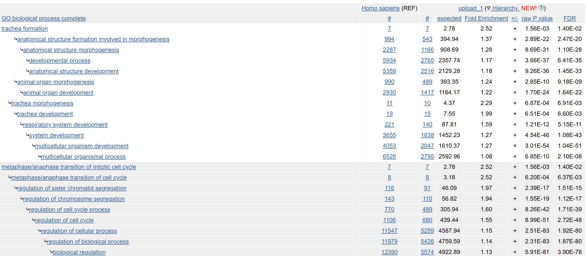

## Background

We are going to dive deeper into some genes and proteins to gain novel insights. For our lab today we are focusing on the HOXA1 gene

## Data Import

Our data comes from:

Trapnell C, Hendrickson DG, Sauvageau M, Goff L et al. "*Differential analysis of gene regulation at transcript resolution with RNA-seq*". Nat Biotechnol 2013 Jan;31(1):46-53. [PMID: 23222703](https://www.ncbi.nlm.nih.gov/pubmed/23222703)

```{r}
library(DESeq2)
metaFile<-"GSE37704_metadata.csv"
countFile<-"GSE37704_featurecounts.csv"
#Now our data is in lets look at it
colData<-read.csv(metaFile, row.names = 1)
head(colData)
countData<- read.csv(countFile, row.names = 1)
head(countData)

#Q. Complete the code below to remove the troublesome first column from countData


#Removing first column
countData <- as.matrix(countData[,2:7])
head(countData)

#Q. Complete the code below to filter countData to exclude genes (i.e. rows) where we have 0 read count across all samples (i.e. columns).

#Remove all 0 reads
countData = countData[rowSums(countData)>0, ]
head(countData)

#Or
to.keep<-rowSums(countData) !=0
countData<- countData[to.keep,]

```

## Setup DESeq object

```{r}
dds= DESeqDataSetFromMatrix(countData = countData,
  colData = colData,
  design=~condition)

dds<-DESeq(dds)
res<- results(dds)
summary(res)
#Q. Call the summary() function on your results to get a sense of how many genes are up or down-regulated at the default 0.1 p-value cutoff.

#According to the summary function, 4349 are up regulated and 4396 are down regulated


```

## Volcano Plot

```{r}
library(ggplot2)
#Q. Improve this plot by completing the below code, which adds color, axis labels and cutoff lines:


my_col<- rep("grey", nrow(res))
my_col[abs(res$log2FoldChange)>2]<-"blue"
my_col[res$padj>0.05]<-"grey"

ggplot(res)+
  aes(log2FoldChange, -log(padj))+
  geom_point(alpha=0.6, col=my_col)+
  geom_vline(xintercept = c(-2,2))+
  geom_hline(yintercept=0)+
   xlab("Log2(FoldChange)") +
  ylab("-Log(P-value)") 

```

## Adding Gene Annotation

```{r}
library(AnnotationDbi)
library(org.Hs.eg.db)

#Q. Use the mapIDs() function multiple times to add SYMBOL, ENTREZID and GENENAME annotation to our results by completing the code below.


#Lets look at the columns
columns(org.Hs.eg.db)

res$symbol=mapIds(org.Hs.eg.db,
                  keys = row.names(res),
                  keytype = "ENSEMBL",
                  column = "SYMBOL",
                  multiVals = "first")

res$entrez=mapIds(org.Hs.eg.db,
                  keys = row.names(res),
                  keytype = "ENSEMBL",
                  column = "ENTREZID",
                  multiVals = "first")

res$name=mapIds(org.Hs.eg.db,
                  keys = row.names(res),
                  keytype = "ENSEMBL",
                  column = "GENENAME",
                  multiVals = "first")

head(res,10)

#Q. Finally for this section let's reorder these results by adjusted p-value and save them to a CSV file in your current project directory.


#lets reorder
res= res[order(res$pvalue),]
write.csv(res,file = "deseq_results.csv")
```

## Pathway Analysis

```{r}
library(pathview)
library(gage)
library(gageData)
data(kegg.sets.hs)
data(sigmet.idx.hs)
#Focusing only signaling and metabolic pathways
kegg.sets.hs=kegg.sets.hs[sigmet.idx.hs]
head(kegg.sets.hs,3)

foldchanges<- res$log2FoldChange
names(foldchanges)=res$entrez
head(foldchanges)
#Lets see the results
keggres <- gage(foldchanges, gsets = kegg.sets.hs)
attributes(keggres)
head(keggres$less)
pathview(gene.data = foldchanges, pathway.id = "hsa04110")
pathview(gene.data=foldchanges, pathway.id="hsa04110", kegg.native=FALSE)
keggrespathways <- rownames(keggres$greater)[1:5]

# Extract the 8 character long IDs part of each string
keggresids = substr(keggrespathways, start=1, stop=8)
keggresids
pathview(gene.data=foldchanges, pathway.id=keggresids, species="hsa")

```


## Section 3. Gene Ontology (GO)

```{r}
data(go.sets.hs)
data(go.subs.hs)

# Focus on Biological Process subset of GO
gobpsets = go.sets.hs[go.subs.hs$BP]

gobpres = gage(foldchanges, gsets=gobpsets)

lapply(gobpres, head)
```

## Section 4. Reactome Analysis

```{r}
sig_genes <- res[res$padj <= 0.05 & !is.na(res$padj), "symbol"]
print(paste("Total number of significant genes:", length(sig_genes)))

write.table(sig_genes, file="significant_genes.txt", row.names=FALSE, col.names=FALSE, quote=FALSE)

```

Q: What pathway has the most significant “Entities p-value”? Do the most significant pathways listed match your previous KEGG results? What factors could cause differences between the two methods?

The cell cycle has the most significant "Entities p-value" of 2.63E-5. Looking at the KEGG results we see the cell cycle is also highlighted, but with a smaller p-value at 8.995727E-6. The difference come from the fact that KEGG has a smaller with more focused data set that cause any overlap to be more significant in comparison to the broader reactome dataset which causes a loss in significance.

## GO Online


