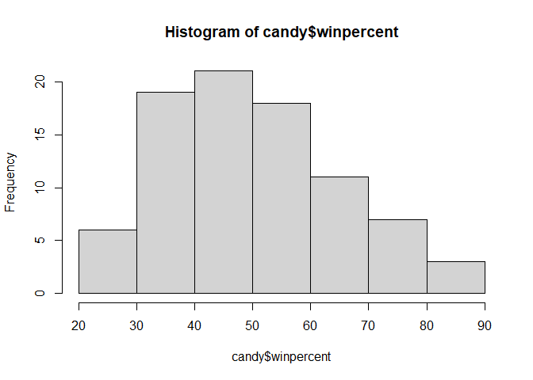
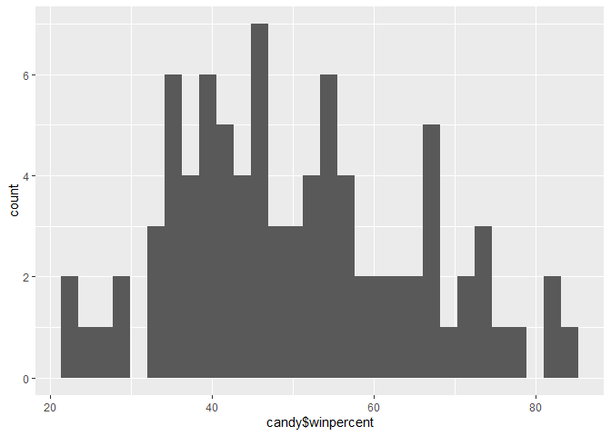
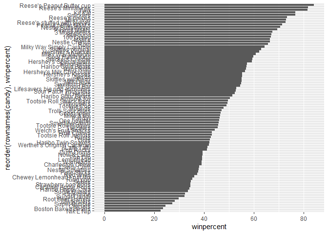
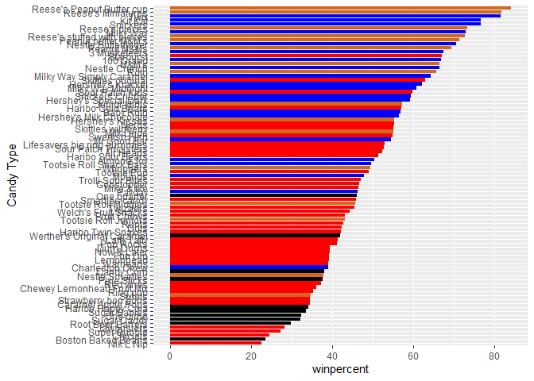
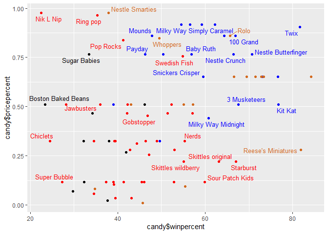
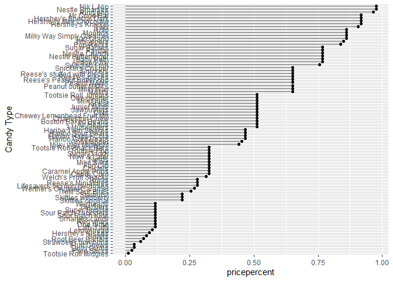
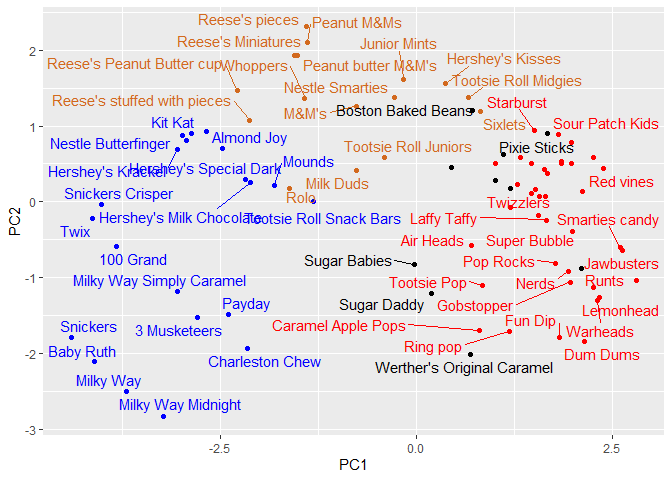

# Class 9
David Majeed (A17885958

- [Background](#background)
- [Data Import](#data-import)
- [What is the favorite candy](#what-is-the-favorite-candy)
- [Exploratory Analysis](#exploratory-analysis)
- [Candy Rankings](#candy-rankings)
- [Adding Color](#adding-color)
- [Pricepercent](#pricepercent)
- [Correlation Structure](#correlation-structure)
- [PCA](#pca)

## Background

We are going to learn more about principal component analysis (PCA)
using a fun data set.

## Data Import

``` r
candy_file <- "candy-data.csv"

candy = read.csv("candy-data.txt", row.names=1)
head(candy)
```

                 chocolate fruity caramel peanutyalmondy nougat crispedricewafer
    100 Grand            1      0       1              0      0                1
    3 Musketeers         1      0       0              0      1                0
    One dime             0      0       0              0      0                0
    One quarter          0      0       0              0      0                0
    Air Heads            0      1       0              0      0                0
    Almond Joy           1      0       0              1      0                0
                 hard bar pluribus sugarpercent pricepercent winpercent
    100 Grand       0   1        0        0.732        0.860   66.97173
    3 Musketeers    0   1        0        0.604        0.511   67.60294
    One dime        0   0        0        0.011        0.116   32.26109
    One quarter     0   0        0        0.011        0.511   46.11650
    Air Heads       0   0        0        0.906        0.511   52.34146
    Almond Joy      0   1        0        0.465        0.767   50.34755

``` r
#Imports our data
```

Q1. There are 85 different types of candy in the dataset

``` r
#each row is a type of candy
nrow(candy)
```

    [1] 85

Q2. There are 38 fruity candies in the data set

``` r
#Counting the sum of fruity candy column should give us the amount
sum(candy$fruity)
```

    [1] 38

## What is the favorite candy

Q3. My favorite candy is Swedish Fish and the winpercent is 54.86111

Q4. The winpercent of Kit Kat is 76.7686

Q5. The winpercent of Tootsie Roll Snack Bars is 49.6535

``` r
candy["Swedish Fish", ]$winpercent
```

    [1] 54.86111

``` r
candy["Kit Kat", ]$winpercent
```

    [1] 76.7686

``` r
candy["Tootsie Roll Snack Bars", ]$winpercent
```

    [1] 49.6535

``` r
#Find the percent for each of the candy by looking at the candy data then for the row in the "" and then by the column winpercent
```

Q6. The winpercent column looks like its on a different scale as every
other variable is in between 0-1 while winpercent has numbers that are
greater than 10

Q7. A zero most likely represents ‘no’ or that there is not any
chocolate in the candy while a 1 represents a ‘yes’ where there is
chocolate in the candy

``` r
#install.packages("skimr")
library("skimr")
#lets skim the whole data det
skim(candy)
```

|                                                  |       |
|:-------------------------------------------------|:------|
| Name                                             | candy |
| Number of rows                                   | 85    |
| Number of columns                                | 12    |
| \_\_\_\_\_\_\_\_\_\_\_\_\_\_\_\_\_\_\_\_\_\_\_   |       |
| Column type frequency:                           |       |
| numeric                                          | 12    |
| \_\_\_\_\_\_\_\_\_\_\_\_\_\_\_\_\_\_\_\_\_\_\_\_ |       |
| Group variables                                  | None  |

Data summary

**Variable type: numeric**

| skim_variable | n_missing | complete_rate | mean | sd | p0 | p25 | p50 | p75 | p100 | hist |
|:---|---:|---:|---:|---:|---:|---:|---:|---:|---:|:---|
| chocolate | 0 | 1 | 0.44 | 0.50 | 0.00 | 0.00 | 0.00 | 1.00 | 1.00 | ▇▁▁▁▆ |
| fruity | 0 | 1 | 0.45 | 0.50 | 0.00 | 0.00 | 0.00 | 1.00 | 1.00 | ▇▁▁▁▆ |
| caramel | 0 | 1 | 0.16 | 0.37 | 0.00 | 0.00 | 0.00 | 0.00 | 1.00 | ▇▁▁▁▂ |
| peanutyalmondy | 0 | 1 | 0.16 | 0.37 | 0.00 | 0.00 | 0.00 | 0.00 | 1.00 | ▇▁▁▁▂ |
| nougat | 0 | 1 | 0.08 | 0.28 | 0.00 | 0.00 | 0.00 | 0.00 | 1.00 | ▇▁▁▁▁ |
| crispedricewafer | 0 | 1 | 0.08 | 0.28 | 0.00 | 0.00 | 0.00 | 0.00 | 1.00 | ▇▁▁▁▁ |
| hard | 0 | 1 | 0.18 | 0.38 | 0.00 | 0.00 | 0.00 | 0.00 | 1.00 | ▇▁▁▁▂ |
| bar | 0 | 1 | 0.25 | 0.43 | 0.00 | 0.00 | 0.00 | 0.00 | 1.00 | ▇▁▁▁▂ |
| pluribus | 0 | 1 | 0.52 | 0.50 | 0.00 | 0.00 | 1.00 | 1.00 | 1.00 | ▇▁▁▁▇ |
| sugarpercent | 0 | 1 | 0.48 | 0.28 | 0.01 | 0.22 | 0.47 | 0.73 | 0.99 | ▇▇▇▇▆ |
| pricepercent | 0 | 1 | 0.47 | 0.29 | 0.01 | 0.26 | 0.47 | 0.65 | 0.98 | ▇▇▇▇▆ |
| winpercent | 0 | 1 | 50.32 | 14.71 | 22.45 | 39.14 | 47.83 | 59.86 | 84.18 | ▃▇▆▅▂ |

``` r
#lets look at just one varriable
skim(candy$chocolate)
```

|                                                  |                  |
|:-------------------------------------------------|:-----------------|
| Name                                             | candy\$chocolate |
| Number of rows                                   | 85               |
| Number of columns                                | 1                |
| \_\_\_\_\_\_\_\_\_\_\_\_\_\_\_\_\_\_\_\_\_\_\_   |                  |
| Column type frequency:                           |                  |
| numeric                                          | 1                |
| \_\_\_\_\_\_\_\_\_\_\_\_\_\_\_\_\_\_\_\_\_\_\_\_ |                  |
| Group variables                                  | None             |

Data summary

**Variable type: numeric**

| skim_variable | n_missing | complete_rate | mean |  sd |  p0 | p25 | p50 | p75 | p100 | hist  |
|:--------------|----------:|--------------:|-----:|----:|----:|----:|----:|----:|-----:|:------|
| data          |         0 |             1 | 0.44 | 0.5 |   0 |   0 |   0 |   1 |    1 | ▇▁▁▁▆ |

## Exploratory Analysis

Lets look at the histograms

Q8.

``` r
hist(candy$winpercent)
```



``` r
library(ggplot2)
ggplot(candy)+ 
  aes(candy$winpercent)+
  geom_histogram()
```

    Warning: Use of `candy$winpercent` is discouraged.
    ℹ Use `winpercent` instead.

    `stat_bin()` using `bins = 30`. Pick better value `binwidth`.



``` r
#Makes a plot
summary(candy$winpercent)
```

       Min. 1st Qu.  Median    Mean 3rd Qu.    Max. 
      22.45   39.14   47.83   50.32   59.86   84.18 

Q.9 The distribution isn’t symmetrical, it is slightly skewed to the
left

Q.10 The center of distribution is slightly above 50% at 50.31676 with
the mean, but looking at the median which would be better for skewed
data like this, it is at 47.83 or bellow %50

Q.11 The average chocolate candy is higher ranked at 60.92153 than
fruity candy at 44.11974

``` r
mean(candy$winpercent[as.logical(candy$chocolate)])
```

    [1] 60.92153

``` r
mean(candy$winpercent[as.logical(candy$fruity)])
```

    [1] 44.11974

``` r
#we can use as.logical() since these are T/F values
```

Q12. The p-value is 2.871e-08 which is much smaller than 0.05 indicating
that it is significant

``` r
t.test((candy$winpercent[as.logical(candy$chocolate)]),candy$winpercent[as.logical(candy$fruity)])
```


        Welch Two Sample t-test

    data:  (candy$winpercent[as.logical(candy$chocolate)]) and candy$winpercent[as.logical(candy$fruity)]
    t = 6.2582, df = 68.882, p-value = 2.871e-08
    alternative hypothesis: true difference in means is not equal to 0
    95 percent confidence interval:
     11.44563 22.15795
    sample estimates:
    mean of x mean of y 
     60.92153  44.11974 

``` r
#uses a t-test function
```

## Candy Rankings

Q.13 The least favorite candies are Nik L Nip, Boston Baked Beans,
Chiclets, Super Bubble, and Jawbusters

``` r
head(candy[order(candy$winpercent),], 5)
```

                       chocolate fruity caramel peanutyalmondy nougat
    Nik L Nip                  0      1       0              0      0
    Boston Baked Beans         0      0       0              1      0
    Chiclets                   0      1       0              0      0
    Super Bubble               0      1       0              0      0
    Jawbusters                 0      1       0              0      0
                       crispedricewafer hard bar pluribus sugarpercent pricepercent
    Nik L Nip                         0    0   0        1        0.197        0.976
    Boston Baked Beans                0    0   0        1        0.313        0.511
    Chiclets                          0    0   0        1        0.046        0.325
    Super Bubble                      0    0   0        0        0.162        0.116
    Jawbusters                        0    1   0        1        0.093        0.511
                       winpercent
    Nik L Nip            22.44534
    Boston Baked Beans   23.41782
    Chiclets             24.52499
    Super Bubble         27.30386
    Jawbusters           28.12744

``` r
#uses the head function to find the candies, the (,5) selects 5
```

Q14. The top 5 are Reese’s Peanut Butter cup, Reese’s Miniatures, Twix,
Kit Kat, and Snickers

``` r
head(candy[order(candy$winpercent, decreasing = T),], 5)
```

                              chocolate fruity caramel peanutyalmondy nougat
    Reese's Peanut Butter cup         1      0       0              1      0
    Reese's Miniatures                1      0       0              1      0
    Twix                              1      0       1              0      0
    Kit Kat                           1      0       0              0      0
    Snickers                          1      0       1              1      1
                              crispedricewafer hard bar pluribus sugarpercent
    Reese's Peanut Butter cup                0    0   0        0        0.720
    Reese's Miniatures                       0    0   0        0        0.034
    Twix                                     1    0   1        0        0.546
    Kit Kat                                  1    0   1        0        0.313
    Snickers                                 0    0   1        0        0.546
                              pricepercent winpercent
    Reese's Peanut Butter cup        0.651   84.18029
    Reese's Miniatures               0.279   81.86626
    Twix                             0.906   81.64291
    Kit Kat                          0.511   76.76860
    Snickers                         0.651   76.67378

``` r
#For the least popular
```

Q15.

``` r
library(ggplot2)
#Makes a plot
ggplot(candy) + 
  aes(winpercent, rownames(candy)) + geom_col()
```


Q16.

``` r
library(ggplot2)

ggplot(candy) + 
  aes(winpercent, reorder(rownames(candy), winpercent)) + geom_col()
```



## Adding Color

``` r
#set all colors
my_cols=rep("black", nrow(candy))
#chocolate 
my_cols[as.logical(candy$chocolate)] = "chocolate"
#bars
my_cols[as.logical(candy$bar)] = "blue"
#fruit
my_cols[as.logical(candy$fruity)] = "red"
#Adds colors to each type of candy for the following plot
ggplot(candy) + 
  aes(winpercent, reorder(rownames(candy), winpercent)) + geom_col(fill=my_cols) +
  ylab("Candy Type")
```



Q17. The worst ranked chocolate is Sixlets

Q18. The best fruity candy is Starburst

## Pricepercent

``` r
#install.packages("ggrepel")
library(ggrepel)

# How about a plot of win vs price
ggplot(candy) +
  aes(candy$winpercent, candy$pricepercent, label=rownames(candy)) +
  geom_point(col=my_cols) + 
  geom_text_repel(col=my_cols, size=3.3, max.overlaps = 5)
```

    Warning: Use of `candy$winpercent` is discouraged.
    ℹ Use `winpercent` instead.

    Warning: Use of `candy$pricepercent` is discouraged.
    ℹ Use `pricepercent` instead.

    Warning: Use of `candy$winpercent` is discouraged.
    ℹ Use `winpercent` instead.

    Warning: Use of `candy$pricepercent` is discouraged.
    ℹ Use `pricepercent` instead.



Q19. It would be Twix

Q20. The most expensive candies are Nik L Nip, Nestle Smarties, Ring
pop, Hershey’s Krackel, Hershey’s Milk Chocolate. With Nik L Nip being
the least popular

``` r
ord <- order(candy$pricepercent, decreasing = TRUE)
head( candy[ord,c(11,12)], n=5 )
```

                             pricepercent winpercent
    Nik L Nip                       0.976   22.44534
    Nestle Smarties                 0.976   37.88719
    Ring pop                        0.965   35.29076
    Hershey's Krackel               0.918   62.28448
    Hershey's Milk Chocolate        0.918   56.49050

Q21.

``` r
ggplot(candy) + 
  aes(pricepercent, reorder(rownames(candy), pricepercent)) + geom_point() +
  geom_segment(aes(yend = reorder(rownames(candy), pricepercent), xend = 0), col="gray40")+
  ylab("Candy Type")
```



## Correlation Structure

``` r
#install.packages("corrplot")
library(corrplot)
```

    corrplot 0.95 loaded

``` r
cij <- cor(candy)
#finds the correlation between each pair of variables 
corrplot(cij)
```


Q22. The strongest anti-correlation is fruity and chocolate

Q23.

Since chocolate and fruit are so anti-correlated, I predict that they
will have the largest contribution to PC1

## PCA

``` r
pca<- prcomp(candy, scale=T)
summary(pca)
```

    Importance of components:
                              PC1    PC2    PC3     PC4    PC5     PC6     PC7
    Standard deviation     2.0788 1.1378 1.1092 1.07533 0.9518 0.81923 0.81530
    Proportion of Variance 0.3601 0.1079 0.1025 0.09636 0.0755 0.05593 0.05539
    Cumulative Proportion  0.3601 0.4680 0.5705 0.66688 0.7424 0.79830 0.85369
                               PC8     PC9    PC10    PC11    PC12
    Standard deviation     0.74530 0.67824 0.62349 0.43974 0.39760
    Proportion of Variance 0.04629 0.03833 0.03239 0.01611 0.01317
    Cumulative Proportion  0.89998 0.93832 0.97071 0.98683 1.00000

``` r
#makes pca of the data, using the scale= T to ensure that the size of winpercent doesn't overwhlem the PCA
```

``` r
ggplot(pca$x)+
  aes(PC1,PC2, label = row.names(pca$x))+ geom_point(col=my_cols)+
  geom_text_repel(col=my_cols)
```



``` r
#graphs the PCA
```

Second major results figure from PCA

``` r
ggplot(pca$rotation) +
  aes(PC1, reorder(row.names(pca$rotation), PC1)) +
  geom_col()
```


Q24. The variables of fruity followed by pluribus and hard were strongly
picked up by PC1 in the postive direction. This makes sense to me,
especially as we saw in the correlation plot how fruity had the
strongest minus correlation with chocolate and a lot of negative
correlation with other variables

Q25. I think I would make a chocolate and bar as that is clearly the
winner. Firstly, looking at the graph of candy type against winpercent,
we see the top of the list occupied by chocolates and bars as evident of
the brown and blue near the top of chart. Next, in our correlation
chart, we see the highest levels of correlation between winpercent is
with chocolate, with bar also being blue but at a lighter shade.
Finally, looking at PCA, such as loading, we see chocolate, bar, and
winpercent close to one another indicating their association. With all
this data in mind, chocolate and bar is a winning candy.
