# Class05
David Majeed (PID:A17885958)

# Class 5 Data Visualization Lab

Questions from Website:

Q1. All the above

Q2. False

Q3. Network Graphs

Q4. ggplot is the only way to create plots in R

Q5. geom_point()

Q6. 5196

Q7. 4

Q8. 127

Q9. 2.44

``` r
#install.packages("ggplot2")
#This installs the software
library(ggplot2)
#To make sure R knows where to look

View(cars)
#view the data set

plot(cars)
```


``` r
#this is the default plotting software

ggplot(data=cars)+
  aes(x=speed, y=dist) + geom_point()
```

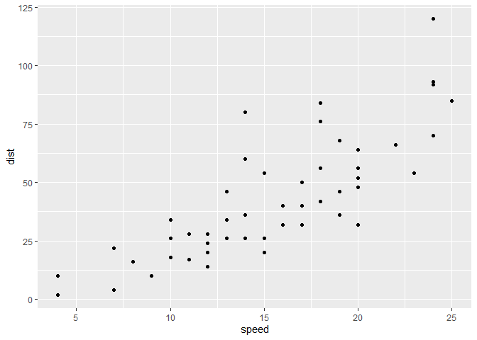

``` r
p <- ggplot(data=cars)+ aes(x=speed, y=dist) + geom_point()

#ggplot() is how we get R to start the function, the (data=cars) has R use the cars data as the data for the graph, the connects the lines rows to one another so we don't have one long line of code, aes() is for the aesthics of graph, geom_point() determines the type of graph such as scatter, p just to put it all in one variable
```

``` r
#Add a trend line close to the data through adding the geom_smooth(). Each subsequent argument adds different elements such as method="lm", se=FALSE which adds a straight line 
p+geom_smooth()
```

    `geom_smooth()` using method = 'loess' and formula = 'y ~ x'

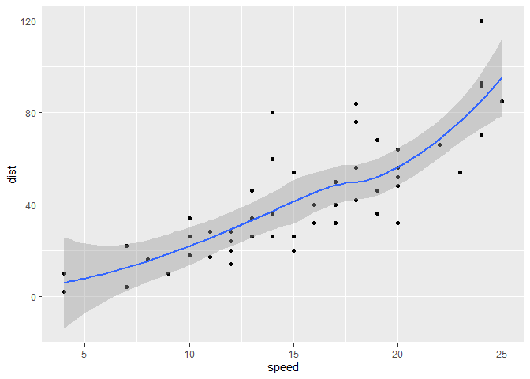

``` r
p+geom_smooth(method="lm", se=F)
```

    `geom_smooth()` using formula = 'y ~ x'

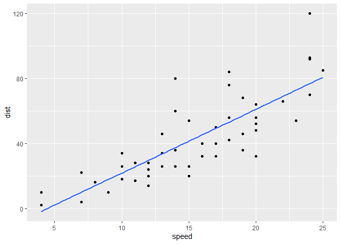

``` r
#labs() adds titles and lables tp pur data, and theme_bw() adds a theme to color our graph

p+geom_smooth(method="lm", se=F)+
labs(title="Speed and Stopping Distances of Cars", x="Speed (MPH)",y="Stopping Distance (ft)", caption="Dataset: 'cars'")+
  theme_bw()
```

    `geom_smooth()` using formula = 'y ~ x'

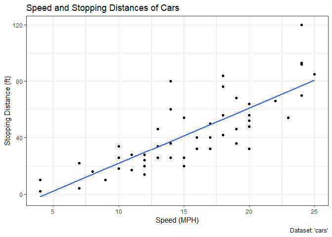

``` r
url <- "https://bioboot.github.io/bimm143_S20/class-material/up_down_expression.txt"

#loads our outside data into a variable we can load in r

genes <- read.delim (url) 
#allows us to read the url through the genes variable

head(genes)
```

            Gene Condition1 Condition2      State
    1      A4GNT -3.6808610 -3.4401355 unchanging
    2       AAAS  4.5479580  4.3864126 unchanging
    3      AASDH  3.7190695  3.4787276 unchanging
    4       AATF  5.0784720  5.0151916 unchanging
    5       AATK  0.4711421  0.5598642 unchanging
    6 AB015752.4 -3.6808610 -3.5921390 unchanging

``` r
#gives the first part of the data
```

``` r
#Let's make a first plot attempt
 g <- ggplot(genes)+ aes(x=Condition1, y=Condition2, col=State)+ geom_point()
 g
```


``` r
 #ggplot(genes) allows us to use our data stored in gene, aes gives us control to plot x and y, col gives us the ability to color by state, geom_point() creates a scatter plot. Let's actually customize this
  g + scale_color_manual(values=c("magenta", "yellow", "pink"))
```

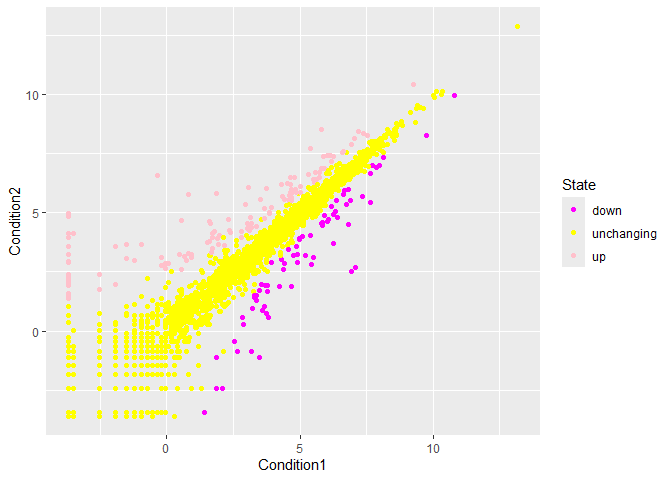

``` r
 #Lab settings
 
 g+ scale_color_manual(values=c("blue", "gray", "red")) + labs(title="Gene expresion changes", x="Control(no drug)", y="Drug Treatment")+ theme_bw()
```

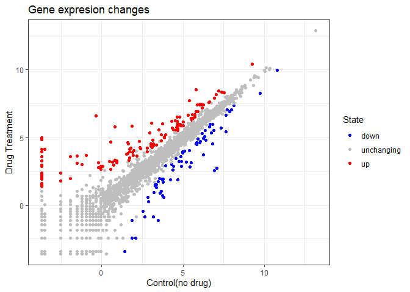

``` r
 #values gives color to the options, labs adds the titles, and theme adds a theme
```

``` r
#lets get data out of this data set
#How many genes in the data set?
nrow(genes)
```

    [1] 5196

``` r
colnames(genes)
```

    [1] "Gene"       "Condition1" "Condition2" "State"     

``` r
ncol(genes)
```

    [1] 4

``` r
#How many up regulated genes?
table(genes$State)
```


          down unchanging         up 
            72       4997        127 

``` r
#Fraction of total genes are upregulated
round((table(genes$State)/nrow(genes))*100, 2)
```


          down unchanging         up 
          1.39      96.17       2.44 

## Beyond

``` r
#install.packages("gapminder")
library(gapminder)
#install.packages("dplyr") 
library(dplyr)
```


    Attaching package: 'dplyr'

    The following objects are masked from 'package:stats':

        filter, lag

    The following objects are masked from 'package:base':

        intersect, setdiff, setequal, union

``` r
gapminder_2007 <- gapminder %>% filter(year==2007)

ggplot(gapminder_2007)+ aes(x=gdpPercap, y=lifeExp,color=continent, size=pop)+ geom_point(alpha=0.5)
```

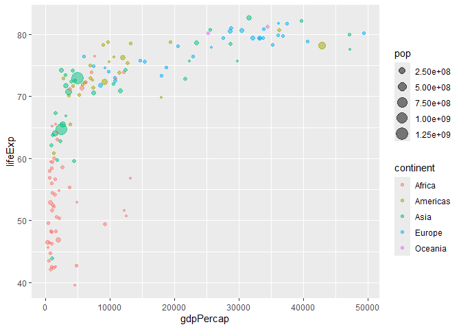

``` r
ggplot(gapminder_2007) + geom_point(aes(x = gdpPercap, y = lifeExp, size = pop), alpha=0.5) + scale_size_area(max_size = 10)
```

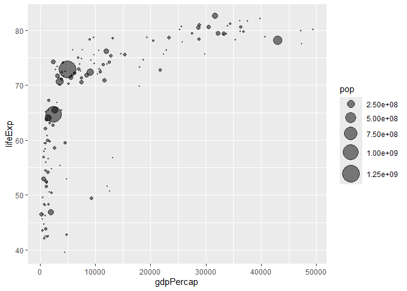

``` r
gapminder_1957<- gapminder %>% filter(year==1957) 

ggplot(gapminder_1957)+ aes(x=gdpPercap, y=lifeExp,color=continent, size=pop)+ geom_point(alpha=0.7) +scale_size_area(max_size = 15)+facet_wrap(~year)
```

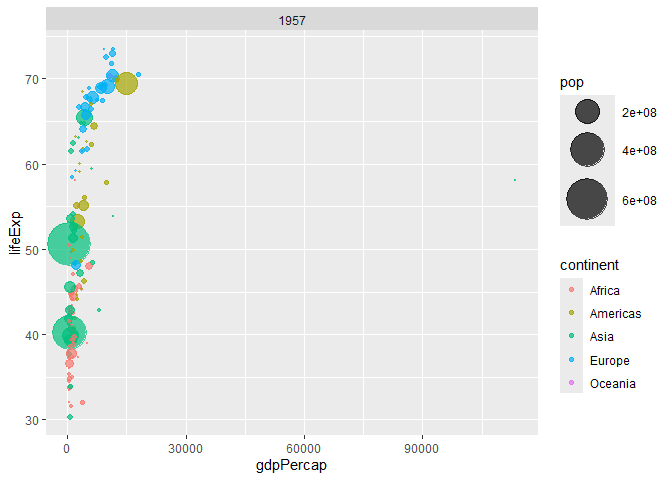

``` r
gapminder_top5 <- gapminder %>% 
  filter(year==2007) %>% 
  arrange(desc(pop)) %>% 
  top_n(5, pop)

gapminder_top5 
```

    # A tibble: 5 × 6
      country       continent  year lifeExp        pop gdpPercap
      <fct>         <fct>     <int>   <dbl>      <int>     <dbl>
    1 China         Asia       2007    73.0 1318683096     4959.
    2 India         Asia       2007    64.7 1110396331     2452.
    3 United States Americas   2007    78.2  301139947    42952.
    4 Indonesia     Asia       2007    70.6  223547000     3541.
    5 Brazil        Americas   2007    72.4  190010647     9066.

``` r
ggplot(gapminder_top5) + geom_col(aes(x = country, y = pop))
```

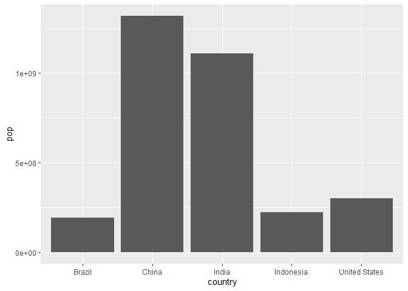

``` r
ggplot(gapminder_top5) + geom_col(aes(x = country, y = pop, fill = continent))
```

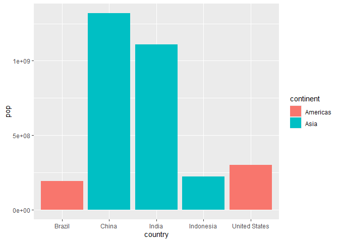

``` r
ggplot(gapminder_top5) + geom_col(aes(x = country, y = pop, fill = lifeExp))
```

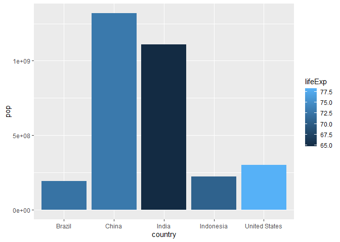

``` r
ggplot(gapminder_top5) +
  geom_col(aes(x = country, y = pop, fill = gdpPercap)) 
```

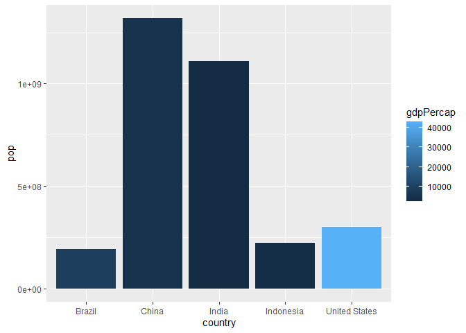

``` r
ggplot(gapminder_top5) + 
  aes(x=reorder(country, -pop), y=pop, fill=gdpPercap) + 
  geom_col()
```

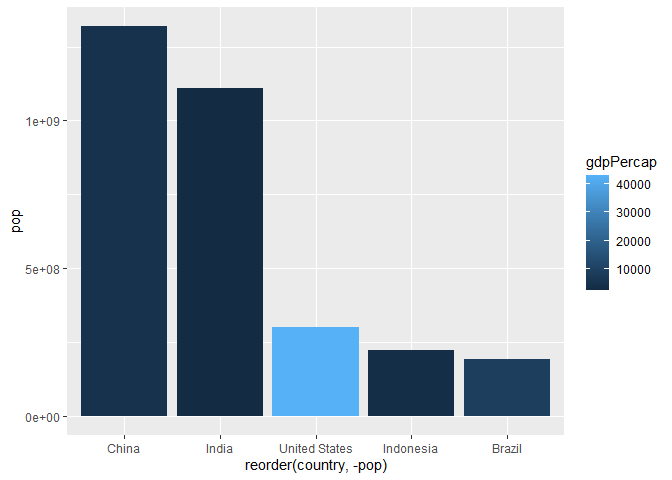

``` r
ggplot(gapminder_top5) + 
  aes(x=reorder(country, -pop), y=pop, fill=country) + 
  geom_col(col="gray30") + guides(fill="none")
```

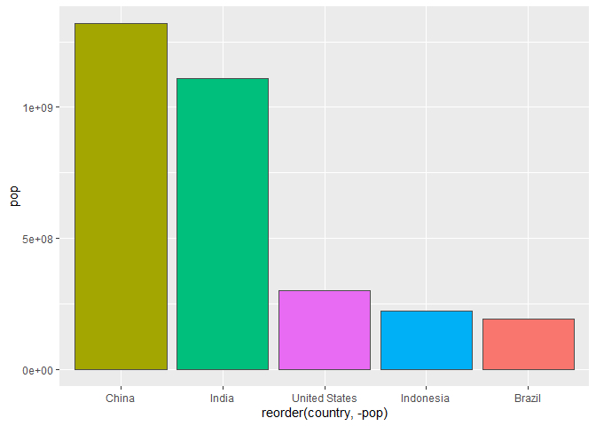

``` r
head(USArrests)
```

               Murder Assault UrbanPop Rape
    Alabama      13.2     236       58 21.2
    Alaska       10.0     263       48 44.5
    Arizona       8.1     294       80 31.0
    Arkansas      8.8     190       50 19.5
    California    9.0     276       91 40.6
    Colorado      7.9     204       78 38.7

``` r
USArrests$State <- rownames(USArrests) 

ggplot(USArrests) +
  aes(x=reorder(State,Murder), y=Murder) + 
  geom_col() +
  coord_flip() 
```

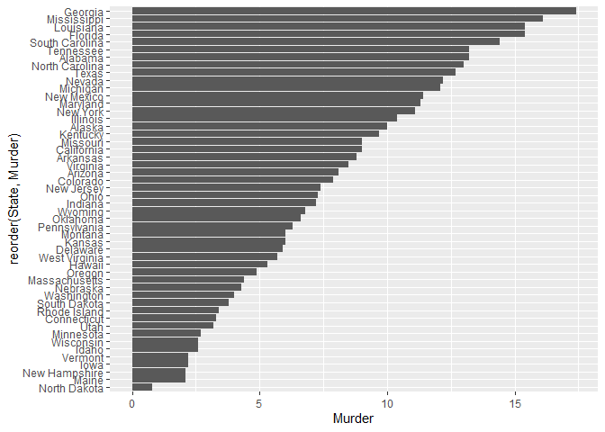

``` r
ggplot(USArrests) +
  aes(x=reorder(State,Murder), y=Murder) + 
  geom_point() + 
  geom_segment(aes(x=State, xend=State, y=0, yend=Murder), color="blue") + 
  coord_flip()
```

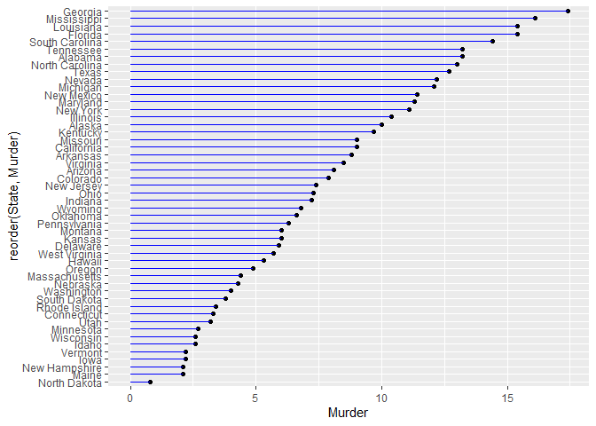

``` r
#install.packages("gifski") #install.packages("gganimate") library(gapminder)

library(gganimate)

ggplot(gapminder, aes(gdpPercap, lifeExp, size=pop, color=country))+ geom_point(alpha=0.7, show.legend = FALSE) + scale_color_manual(values = country_colors) + scale_size(range = c(2,12))+ scale_x_log10()+ facet_wrap(~continent)+ labs(title='Year: {frame_time}', x='GDP per cpaita', y='life expectancy')+ transition_time(year)+ shadow_wake(wake_length = 0.1, alpha = FALSE)
```

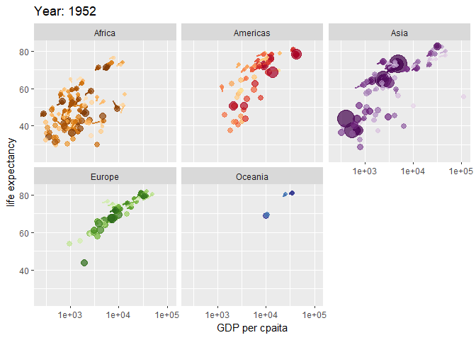

``` r
#install.packages("patchwork")

library(patchwork)
p1<- ggplot(mtcars)+geom_point(aes(mpg, disp)) 
p2<- ggplot(mtcars)+ geom_boxplot(aes(gear, disp, group = gear))
p3 <- ggplot(mtcars) + geom_smooth(aes(disp, qsec)) 
p4 <- ggplot(mtcars) + geom_bar(aes(carb)) 

(p1 | p2 | p3)/ p4
```

    `geom_smooth()` using method = 'loess' and formula = 'y ~ x'

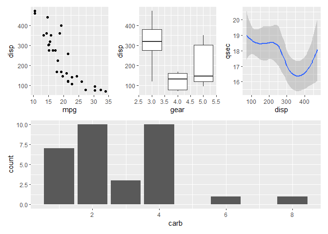

``` r
sessionInfo()
```

    R version 4.5.3 (2026-03-11 ucrt)
    Platform: x86_64-w64-mingw32/x64
    Running under: Windows 11 x64 (build 26200)

    Matrix products: default
      LAPACK version 3.12.1

    locale:
    [1] LC_COLLATE=English_United States.utf8 
    [2] LC_CTYPE=English_United States.utf8   
    [3] LC_MONETARY=English_United States.utf8
    [4] LC_NUMERIC=C                          
    [5] LC_TIME=English_United States.utf8    

    time zone: America/Los_Angeles
    tzcode source: internal

    attached base packages:
    [1] stats     graphics  grDevices utils     datasets  methods   base     

    other attached packages:
    [1] patchwork_1.3.2  gganimate_1.0.11 dplyr_1.2.1      gapminder_1.0.1 
    [5] ggplot2_4.0.3   

    loaded via a namespace (and not attached):
     [1] Matrix_1.7-4       gtable_0.3.6       jsonlite_2.0.0     crayon_1.5.3      
     [5] compiler_4.5.3     tidyselect_1.2.1   progress_1.2.3     splines_4.5.3     
     [9] scales_1.4.0       yaml_2.3.12        fastmap_1.2.0      lattice_0.22-9    
    [13] R6_2.6.1           labeling_0.4.3     generics_0.1.4     knitr_1.51        
    [17] tibble_3.3.1       pillar_1.11.1      RColorBrewer_1.1-3 rlang_1.2.0       
    [21] utf8_1.2.6         stringi_1.8.7      xfun_0.57          S7_0.2.2          
    [25] otel_0.2.0         cli_3.6.6          tweenr_2.0.3       withr_3.0.2       
    [29] magrittr_2.0.5     mgcv_1.9-4         digest_0.6.39      grid_4.5.3        
    [33] rstudioapi_0.18.0  hms_1.1.4          lifecycle_1.0.5    nlme_3.1-168      
    [37] prettyunits_1.2.0  vctrs_0.7.3        evaluate_1.0.5     glue_1.8.1        
    [41] farver_2.1.2       gifski_1.32.0-2    rmarkdown_2.31     tools_4.5.3       
    [45] pkgconfig_2.0.3    htmltools_0.5.9   
