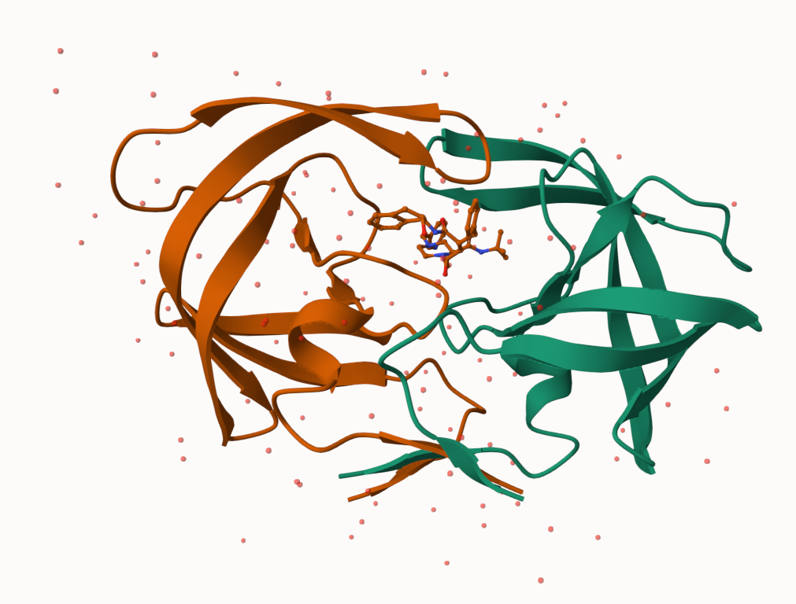

# Class 10
David Majeed (PID:A17885958)

- [Background](#background)
- [PDB Stats](#pdb-stats)
- [Visualizing PDB Data With
  Mol-star](#visualizing-pdb-data-with-mol-star)
- [Let’s Predict The Flexibility of A Given
  Structure](#lets-predict-the-flexibility-of-a-given-structure)
- [Comparative Analysis of The ADK
  Family](#comparative-analysis-of-the-adk-family)

## Background

The main repository of high-resolution data on biomolecules is called
the Protein Data Bank (PDB)

## PDB Stats

What is in the PDB in terms of molecule type and strurcture
determination method

``` r
#read the file from the rcsb website and then format properly
pdb<- read.csv("Data Export Summary.csv")
x<-pdb$X.ray
tmp<-sub(",","", x)
sum(as.numeric(tmp))
```

    [1] 203794

``` r
#Lets make this a function

rm.comma<- function(x) {
  tmp<-sub(",","", x)
  sum(as.numeric(tmp))
}

rm.comma(pdb$EM)
```

    [1] 33880

``` r
#we can also use a different import function 
library(readr)
read_csv("Data Export Summary.csv")
```

    Rows: 6 Columns: 9
    ── Column specification ────────────────────────────────────────────────────────
    Delimiter: ","
    chr (1): Molecular Type
    dbl (4): Integrative, Multiple methods, Neutron, Other
    num (4): X-ray, EM, NMR, Total

    ℹ Use `spec()` to retrieve the full column specification for this data.
    ℹ Specify the column types or set `show_col_types = FALSE` to quiet this message.

    # A tibble: 6 × 9
      `Molecular Type`    `X-ray`    EM   NMR Integrative `Multiple methods` Neutron
      <chr>                 <dbl> <dbl> <dbl>       <dbl>              <dbl>   <dbl>
    1 Protein (only)       180758 23111 12813         348                229      84
    2 Protein/Oligosacch…   10488  3741    34           8                 11       1
    3 Protein/NA             9205  6751   287          26                  8       0
    4 Nucleic acid (only)    3154   250  1578           3                 15       3
    5 Other                   178    27    35           4                  0       0
    6 Oligosaccharide (o…      11     0     6           0                  1       0
    # ℹ 2 more variables: Other <dbl>, Total <dbl>

``` r
#lets find the percetange found by x-ray

n.tot <- rm.comma(pdb$Total)
n.xray<- rm.comma(pdb$X.ray)
n.em<- rm.comma(pdb$EM)

(n.xray+n.em)/n.tot 
```

    [1] 0.9386623

``` r
#How many total proteins?
pdb[1,9]
```

    [1] "217,375"

``` r
#there are 202556314 sequences known for proteins
217375/202556314
```

    [1] 0.001073158

Q1. 93.87% of structures in the PDB are solved by X-Ray and Electron
Microscopy

Q2. There are 217,375 proteins; this is only 0.11% of known proteins.
With most only known through one method

Q3. There are 1,227 structures that are shown when searching for HIV-1
protease

## Visualizing PDB Data With Mol-star

Main stand alone website verision




``` r
#install.packages("pak")
library(bio3d)
#pak::pkg_install(c("bioboot/3dview", "NGLViewR", "bioc::msa"))

pdb<- read.pdb("1hsg")
```

      Note: Accessing on-line PDB file

``` r
pdb
```


     Call:  read.pdb(file = "1hsg")

       Total Models#: 1
         Total Atoms#: 1686,  XYZs#: 5058  Chains#: 2  (values: A B)

         Protein Atoms#: 1514  (residues/Calpha atoms#: 198)
         Nucleic acid Atoms#: 0  (residues/phosphate atoms#: 0)

         Non-protein/nucleic Atoms#: 172  (residues: 128)
         Non-protein/nucleic resid values: [ HOH (127), MK1 (1) ]

       Protein sequence:
          PQITLWQRPLVTIKIGGQLKEALLDTGADDTVLEEMSLPGRWKPKMIGGIGGFIKVRQYD
          QILIEICGHKAIGTVLVGPTPVNIIGRNLLTQIGCTLNFPQITLWQRPLVTIKIGGQLKE
          ALLDTGADDTVLEEMSLPGRWKPKMIGGIGGFIKVRQYDQILIEICGHKAIGTVLVGPTP
          VNIIGRNLLTQIGCTLNF

    + attr: atom, xyz, seqres, helix, sheet,
            calpha, remark, call

``` r
attributes(pdb)
```

    $names
    [1] "atom"   "xyz"    "seqres" "helix"  "sheet"  "calpha" "remark" "call"  

    $class
    [1] "pdb" "sse"

``` r
head(pdb$atom)
```

      type eleno elety  alt resid chain resno insert      x      y     z o     b
    1 ATOM     1     N <NA>   PRO     A     1   <NA> 29.361 39.686 5.862 1 38.10
    2 ATOM     2    CA <NA>   PRO     A     1   <NA> 30.307 38.663 5.319 1 40.62
    3 ATOM     3     C <NA>   PRO     A     1   <NA> 29.760 38.071 4.022 1 42.64
    4 ATOM     4     O <NA>   PRO     A     1   <NA> 28.600 38.302 3.676 1 43.40
    5 ATOM     5    CB <NA>   PRO     A     1   <NA> 30.508 37.541 6.342 1 37.87
    6 ATOM     6    CG <NA>   PRO     A     1   <NA> 29.296 37.591 7.162 1 38.40
      segid elesy charge
    1  <NA>     N   <NA>
    2  <NA>     C   <NA>
    3  <NA>     C   <NA>
    4  <NA>     O   <NA>
    5  <NA>     C   <NA>
    6  <NA>     C   <NA>

There are lots of functions that can work with these `pdb` objects

``` r
head(pdbseq(pdb))
```

      1   2   3   4   5   6 
    "P" "Q" "I" "T" "L" "W" 

``` r
library(bio3dview)

#view.pdb(pdb)
#view.pdb(pdb, colorScheme = "sse", backgroundColor = "black" )
```

``` r
#Lets highlight the active site ASP, the two chains, and the ligands
library(NGLVieweR)
#active.site<- atom.select(pdb, resno=25)
#view.pdb(pdb,
#         cols = c("red", "blue"),
#         highlight = active.site,
#         highlight.style = "spacefill",
#         backgroundColor = "grey") |>
#setRock()
```

## Let’s Predict The Flexibility of A Given Structure

Let’s do a Normal Mode Analysis (NMA) to predict the flexiblity of a pdb
object

``` r
adk<- read.pdb("6s36")
```

      Note: Accessing on-line PDB file
       PDB has ALT records, taking A only, rm.alt=TRUE

``` r
#summary
adk
```


     Call:  read.pdb(file = "6s36")

       Total Models#: 1
         Total Atoms#: 1898,  XYZs#: 5694  Chains#: 1  (values: A)

         Protein Atoms#: 1654  (residues/Calpha atoms#: 214)
         Nucleic acid Atoms#: 0  (residues/phosphate atoms#: 0)

         Non-protein/nucleic Atoms#: 244  (residues: 244)
         Non-protein/nucleic resid values: [ CL (3), HOH (238), MG (2), NA (1) ]

       Protein sequence:
          MRIILLGAPGAGKGTQAQFIMEKYGIPQISTGDMLRAAVKSGSELGKQAKDIMDAGKLVT
          DELVIALVKERIAQEDCRNGFLLDGFPRTIPQADAMKEAGINVDYVLEFDVPDELIVDKI
          VGRRVHAPSGRVYHVKFNPPKVEGKDDVTGEELTTRKDDQEETVRKRLVEYHQMTAPLIG
          YYSKEAEAGNTKYAKVDGTKPVAEVRADLEKILG

    + attr: atom, xyz, seqres, helix, sheet,
            calpha, remark, call

``` r
m<-nma(adk)
```

     Building Hessian...        Done in 0.03 seconds.
     Diagonalizing Hessian...   Done in 0.35 seconds.

``` r
#make a graph
plot(m)
```


``` r
#view.nma(m)
#write out the results of for viewing in Mol-Star
mktrj(m, file="nma.pdb")
```

## Comparative Analysis of The ADK Family

Our first step is finding the sequence with the “1ake_A” id

``` r
library(NGLVieweR)
library(bio3dview)

#id<-"1ake_A"
#aa<- get.seq(id)
#blast<-blast.pdb(aa)
#hits<-plot(blast)
#hits$pdb.id
#files <- get.pdb(hits$pdb.id, path="pdbs", split=TRUE, gzip=TRUE)

#Align and superpose all these ADK files
#pdbs <- pdbaln(files, fit = TRUE, exefile="msa")
#pdbs
#view.pdbs(pdbs)

#Some code turned into text as R was having issues rendering it as a pdf
```

PCA of all this data cordinates

``` r
#pc<-pca(pdbs)
#plot(pc, 1:2)

#interactive view
#view.pca(pc)
#mktrj(pc, file="pca.pdb")
```
