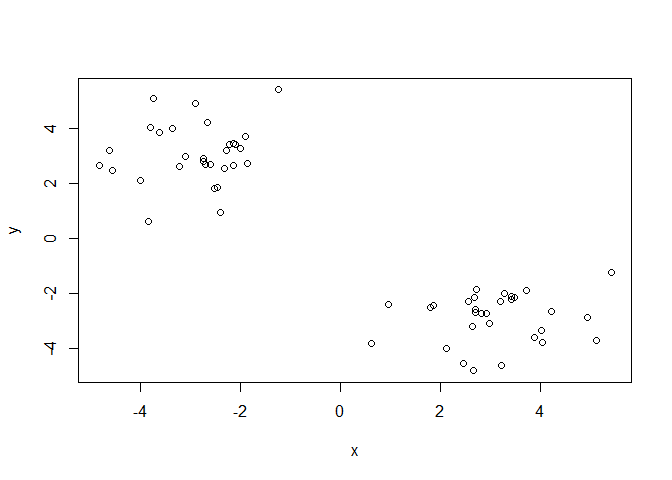
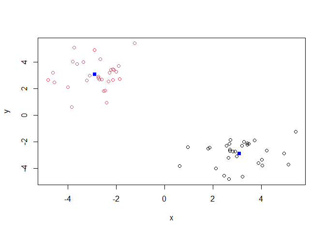
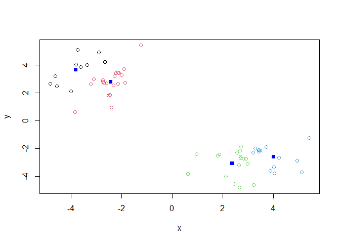
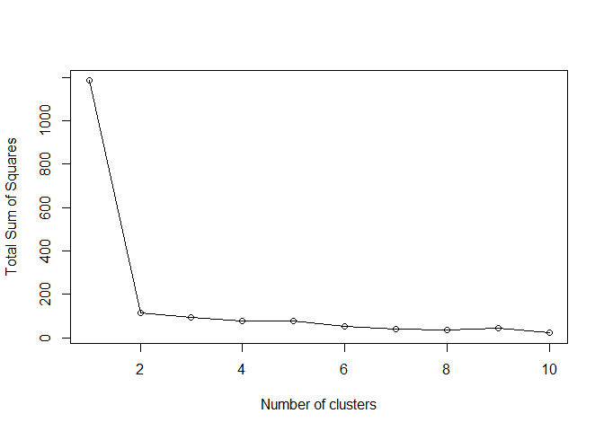
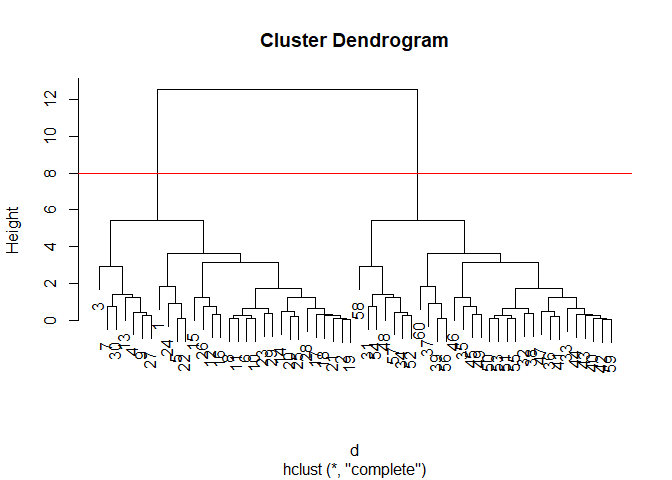
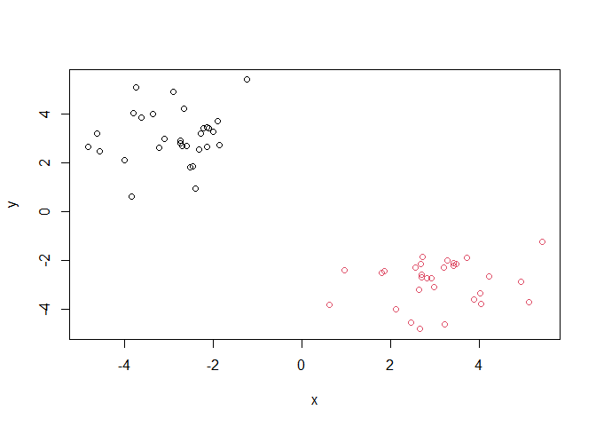
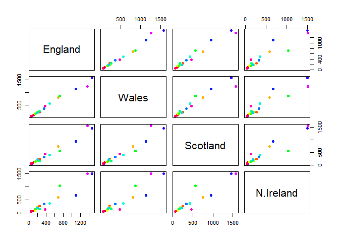
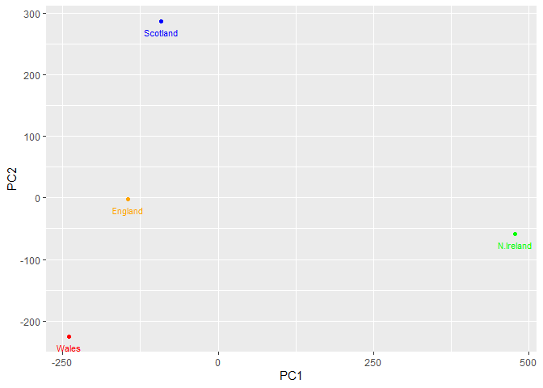
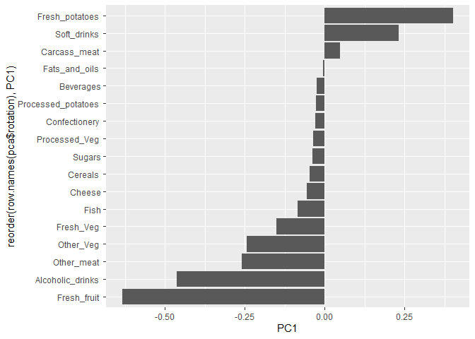
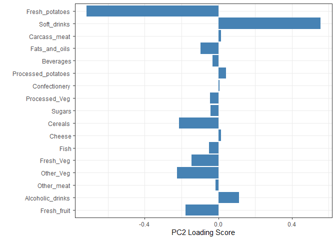

# Class 7
David Majeed (A17885958)

- [Background](#background)
- [Principal Component Analysis
  (PCA)](#principal-component-analysis-pca)
- [Bar Plot](#bar-plot)
- [Pairwise & Heat Map](#pairwise--heat-map)
- [PCA Plots](#pca-plots)

## Background

Today we will explore some core machine learning methods that are very
popular.

These include **clustering** and **dimensional reduction** K-Means
Clustering

The main function for K-means clustering is `kmeans()` Lets make some
simple data with the `rnorm()`

``` r
x<- c(rnorm(30, -3),
rnorm(30, 3))
x
```

     [1] -3.8308269 -2.1313048 -1.2438656 -3.3479853 -2.5217757 -2.5895376
     [7] -2.8874897 -2.7453825 -3.6199753 -2.7043575 -2.7296326 -4.8231623
    [13] -3.7305219 -1.8576450 -3.9932124 -4.5490545 -2.2857885 -1.9957103
    [19] -2.1064173 -2.1366771 -2.2164919 -2.4495257 -3.1042319 -2.3936809
    [25] -2.3092947 -4.6270738 -3.7988851 -1.8893766 -3.2174438 -2.6545746
    [31]  4.2269817  2.6461513  3.7154577  4.0487091  3.2228185  2.5731990
    [37]  0.9553302  2.9754123  1.8590467  3.4236164  2.6775047  3.4195034
    [43]  3.2926075  3.2028903  2.4710179  2.1333895  2.7293904  5.1160711
    [49]  2.6621737  2.8258578  2.7103765  3.8804240  2.9266697  4.9367249
    [55]  2.7122165  1.8081686  4.0312687  5.4193897  3.4752654  0.6337014

``` r
#c() makes a vector, rnorm generates numbers from a normal distribution

z<- cbind(x=x, y=rev(x))
plot(z)
```



``` r
#cbind puts the two data sets of x and rev(x) together
```

``` r
km<- kmeans(z, 2)
#we can now use kmeans, the first input is z which is our data it will
#look at. The 2 is the number of clusters
#We can dive deeper with the attributes() function
attributes(km)
```

    $names
    [1] "cluster"      "centers"      "totss"        "withinss"     "tot.withinss"
    [6] "betweenss"    "size"         "iter"         "ifault"      

    $class
    [1] "kmeans"

``` r
#Q? How many points in each cluster?
sum(km$cluster==2)
```

    [1] 30

``` r
sum(km$cluster==1)
```

    [1] 30

``` r
#Or use this
km$size
```

    [1] 30 30

``` r
#Q? What componet of your result object 
#details cluster assignmnet/membership
km$cluster
```

     [1] 2 2 2 2 2 2 2 2 2 2 2 2 2 2 2 2 2 2 2 2 2 2 2 2 2 2 2 2 2 2 1 1 1 1 1 1 1 1
    [39] 1 1 1 1 1 1 1 1 1 1 1 1 1 1 1 1 1 1 1 1 1 1

``` r
#Q? Can we plot our data 'z' and color by kmeans cluster 
#and add cluster centers as blue points

plot(z,col=km$cluster)
points(km$centers, col="blue", pch=15)
```



``` r
#points() put points on the graph and pch=makes the points bigger

#Q? Run a K-means clustering and plot the results asking for 4 cluster

kn<-kmeans(z, 4)
kn
```

    K-means clustering with 4 clusters of sizes 10, 20, 17, 13

    Cluster means:
              x         y
    1 -3.803193  3.672958
    2 -2.422948  2.799088
    3  2.383672 -3.093089
    4  4.014532 -2.608337

    Clustering vector:
     [1] 2 2 2 1 2 2 1 2 1 2 2 1 1 2 1 1 2 2 2 2 2 2 2 2 2 1 1 2 2 1 4 3 4 4 3 3 3 3
    [39] 3 4 3 4 4 4 3 3 3 4 3 3 3 4 3 4 3 3 4 4 4 3

    Within cluster sum of squares by cluster:
    [1] 14.05394 25.36837 21.70584 14.18377
     (between_SS / total_SS =  93.6 %)

    Available components:

    [1] "cluster"      "centers"      "totss"        "withinss"     "tot.withinss"
    [6] "betweenss"    "size"         "iter"         "ifault"      

``` r
plot(z,col=kn$cluster)
points(kn$centers, col="blue", pch=15)
```



One approach is to try different values for center and then pick the
best

``` r
ans<- NULL
for(i in 1:10){
km<-kmeans(z,i)

ans<- c(ans, km$tot.withinss)

}
plot(ans, type="o",
     xlab="Number of clusters",
     ylab= "Total Sum of Squares")
```



Hierarchical Clustering

The main function for hierarchical clustering is `hclust()`

The function does not take your “raw” data, you need a distance matrix

``` r
d<-dist(z)
hc<-hclust(d)
hc
```


    Call:
    hclust(d = d)

    Cluster method   : complete 
    Distance         : euclidean 
    Number of objects: 60 

There is a bespoke plot() method for hclust() result objects

``` r
plot(hc)
abline(h=8, col="red")
```



``` r
#This is how we see the cross bars, the abline() draws a line
#We can cut it to reveal the cluster

grps <- cutree(hc, k=2)

#Q? Make a plot of 'z' with yoyr hclust results (color by cluster membership)

plot(z, col=grps)
```



## Principal Component Analysis (PCA)

PCA is a dimensional reduction method that is popular for revealing
patterns in complex datasets

Analysis of UK Food

``` r
url <- "https://tinyurl.com/UK-foods" 
x <- read.csv(url) 
#load our data from the internet

nrow(x) 
```

    [1] 17

``` r
ncol(x) 
```

    [1] 5

``` r
dim(x) 
```

    [1] 17  5

``` r
#lets find how many rows and columns
```

Q1. 17 rows and 5 columns

``` r
View(x)
#lets us view the code

#lets set up the rows properly
url <- "https://tinyurl.com/UK-foods" 
x <- read.csv(url)
rownames(x) <- x[,1]
x <- x[,-1]
head(x)
```

                   England Wales Scotland N.Ireland
    Cheese             105   103      103        66
    Carcass_meat       245   227      242       267
    Other_meat         685   803      750       586
    Fish               147   160      122        93
    Fats_and_oils      193   235      184       209
    Sugars             156   175      147       139

``` r
View(x)
dim(x)
```

    [1] 17  4

``` r
#restate x in order to define it properly for these steps
```

``` r
x <- read.csv(url, row.names=1)
head(x)
```

                   England Wales Scotland N.Ireland
    Cheese             105   103      103        66
    Carcass_meat       245   227      242       267
    Other_meat         685   803      750       586
    Fish               147   160      122        93
    Fats_and_oils      193   235      184       209
    Sugars             156   175      147       139

``` r
#Alt. way to what we did above
```

Q.2 I prefer the second method as it is more efficient to code needing
less lines and thus leading to less room for mistakes. I was stuck on
the first method due to an error in the code which the second method was
able to handle much faster. In the circumstance that you do not know how
the table looks, the second method is better as it directly goes to the
.cvs file.

## Bar Plot

``` r
#lets graph it
barplot(as.matrix(x), beside=T, col=rainbow(nrow(x)))
```


``` r
#If we want to stack it we can remove the besides=T
barplot(as.matrix(x), beside=F, col=rainbow(nrow(x)))
```


Q.3 By turning the besides = false we can stack it

``` r
#install.packages("tidyr")
library(tidyr)

# Convert data to long format for ggplot with `pivot_longer()`
x_long <- x |> 
          tibble::rownames_to_column("Food") |> 
          pivot_longer(cols = -Food, 
                       names_to = "Country", 
                       values_to = "Consumption")

dim(x_long)
```

    [1] 68  3

``` r
#Lets make ggplot for a grouped bar plot
library(ggplot2)

ggplot(x_long) +
  aes(x = Country, y = Consumption, fill = Food) +
  geom_col(position = "dodge") +
  theme_bw()
```


``` r
#Lets stack it
ggplot(x_long) +
  aes(x = Country, y = Consumption, fill = Food) +
  geom_col() +
  theme_bw()
```


Q.4 Similarly to the barplot function, we just need to remove a piece of
the code to stack it. For ggplot() we remove “position =”dodge”” which
then will stack it

## Pairwise & Heat Map

``` r
pairs(x, col=rainbow(nrow(x)), pch=16)
```



Q.5 Let’s make a pairwise plot. This is done using the pairs() function,
we then use ‘x’ to signfiy which data set, and then, we use
col=rainbow(nrow(x)) to color the dots based on the row they come from,
and finally, pch=16 allows us to control the size of the dots. The graph
then maps each country to one another and compares them, if they all
line up on a diagonal then the data points are similar to one another

``` r
#lets make some heat maps
#install.packages("pheatmap")
library(pheatmap)

pheatmap( as.matrix(x) )
```


Q.6 From the heatmap, we can see that Wales and England are most similar
to one another. The biggest difference between N. Ireland and the rest
of the UK is in alcoholic drinks

The main function for PCA is prcomp(). The function wants the
obesrevations to be the rows and the variables to be the columns

## PCA Plots

Q.7

``` r
pca <- prcomp (t(x))

# Create a data frame for plotting
df <- as.data.frame(pca$x)
df$Country <- rownames(df)

# Plot PC1 vs PC2 with ggplot
ggplot(pca$x) +
  aes(x = PC1, y = PC2, label = rownames(pca$x)) +
  geom_point(size = 3) +
  geom_text(vjust = -0.5) +
  xlim(-270, 500) +
  xlab("PC1") +
  ylab("PC2") +
  theme_bw()
```


Q.8

``` r
t(x)
```

              Cheese Carcass_meat  Other_meat  Fish Fats_and_oils  Sugars
    England      105           245         685  147            193    156
    Wales        103           227         803  160            235    175
    Scotland     103           242         750  122            184    147
    N.Ireland     66           267         586   93            209    139
              Fresh_potatoes  Fresh_Veg  Other_Veg  Processed_potatoes 
    England               720        253        488                 198
    Wales                 874        265        570                 203
    Scotland              566        171        418                 220
    N.Ireland            1033        143        355                 187
              Processed_Veg  Fresh_fruit  Cereals  Beverages Soft_drinks 
    England              360         1102     1472        57         1374
    Wales                365         1137     1582        73         1256
    Scotland             337          957     1462        53         1572
    N.Ireland            334          674     1494        47         1506
              Alcoholic_drinks  Confectionery 
    England                 375             54
    Wales                   475             64
    Scotland                458             62
    N.Ireland               135             41

``` r
#transposes our data
pca <- prcomp (t(x))
summary(pca)
```

    Importance of components:
                                PC1      PC2      PC3       PC4
    Standard deviation     324.1502 212.7478 73.87622 3.176e-14
    Proportion of Variance   0.6744   0.2905  0.03503 0.000e+00
    Cumulative Proportion    0.6744   0.9650  1.00000 1.000e+00

``` r
#The returned pca objects has components that we can use to make our main result figures

attributes(pca)
```

    $names
    [1] "sdev"     "rotation" "center"   "scale"    "x"       

    $class
    [1] "prcomp"

``` r
#The main results figure from this analysis is called a PC scored plot

pca$x
```

                     PC1         PC2        PC3           PC4
    England   -144.99315   -2.532999 105.768945 -4.894696e-14
    Wales     -240.52915 -224.646925 -56.475555  5.700024e-13
    Scotland   -91.86934  286.081786 -44.415495 -7.460785e-13
    N.Ireland  477.39164  -58.901862  -4.877895  2.321303e-13

``` r
my_color<- c("orange","red","blue", "green")

library(ggplot2)
ggplot(pca$x)+
  aes(PC1,PC2, label=row.names(pca$x))+
  geom_point(col=my_color)+
  geom_text(size=3,vjust=2, col=my_color)
```



The PC score plot allows us to visually see how the countries vary from
one another in a 2d space despite representing 17 data axis. From it we
can see that Northern Ireland is the most different than any other
country in the United Kingdom.

``` r
ggplot(pca$rotation)+
  aes(PC1, reorder(row.names(pca$rotation),PC1))+
  geom_col()
```



The loading plot allows us to see how each of the different categories
differ from one another, this is in contrast to the last plot where we
were able to see differences among countries but not the categories.
This plot can help us find which data axis we should investigate more
into.

Q.9. The two food groups are fresh potatoes and soft drinks. PC2 is the
axis that spans the second most variation after

``` r
ggplot(pca$rotation) +
  aes(x = PC2, 
      y = reorder(rownames(pca$rotation), PC1)) +
  geom_col(fill = "steelblue") +
  xlab("PC2 Loading Score") +
  ylab("") +
  theme_bw() +
  theme(axis.text.y = element_text(size = 9))
```


