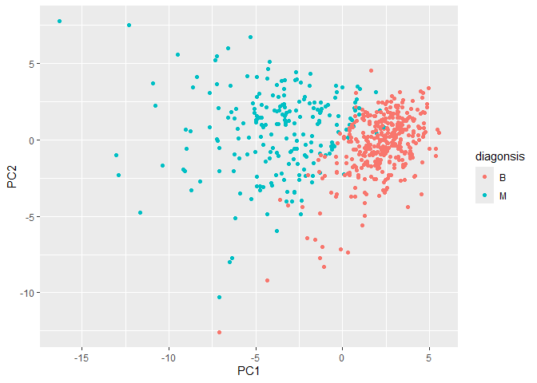
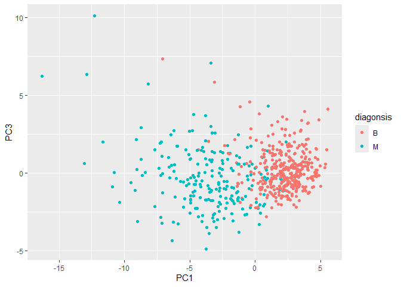
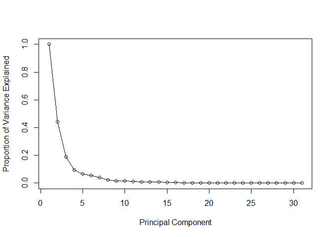
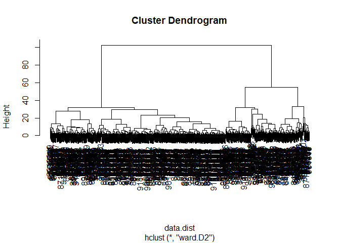
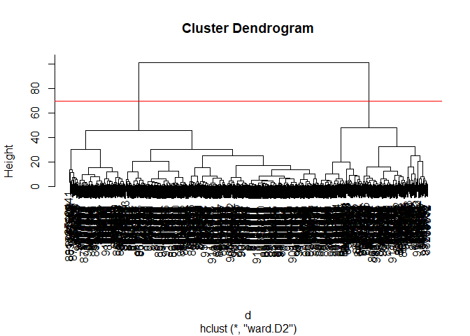
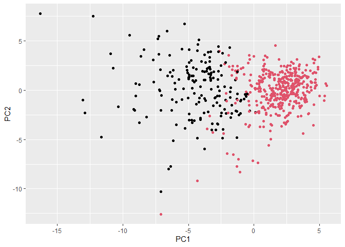
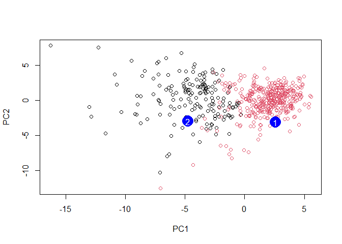

# Class8
David Majeed (A17885958)

- [Intro](#intro)
- [Data Import](#data-import)
- [Exploring the Data](#exploring-the-data)
- [PCA](#pca)
- [Variance](#variance)
- [Hierarchical Clustering](#hierarchical-clustering)
- [Combining methods](#combining-methods)
- [Sensitivity/ Specificity](#sensitivity-specificity)
- [Prediction](#prediction)

## Intro

Our goal is to analysis data coming from breast cancer research using
the techniques we have learnt in other classes.

## Data Import

The data comes from fine needle aspiration

``` r
library(readr)


fna.data <- read_csv("WisconsinCancer.csv")
```

    Rows: 569 Columns: 32
    ── Column specification ────────────────────────────────────────────────────────
    Delimiter: ","
    chr  (1): diagnosis
    dbl (31): id, radius_mean, texture_mean, perimeter_mean, area_mean, smoothne...

    ℹ Use `spec()` to retrieve the full column specification for this data.
    ℹ Specify the column types or set `show_col_types = FALSE` to quiet this message.

``` r
#read.csv allows us to import our data set

wisc.df<- read.csv("WisconsinCancer.csv", row.names=1)
#Shift the row names by 1 to line up our data properly

head(wisc.df,3)
```

             diagnosis radius_mean texture_mean perimeter_mean area_mean
    842302           M       17.99        10.38          122.8      1001
    842517           M       20.57        17.77          132.9      1326
    84300903         M       19.69        21.25          130.0      1203
             smoothness_mean compactness_mean concavity_mean concave.points_mean
    842302           0.11840          0.27760         0.3001             0.14710
    842517           0.08474          0.07864         0.0869             0.07017
    84300903         0.10960          0.15990         0.1974             0.12790
             symmetry_mean fractal_dimension_mean radius_se texture_se perimeter_se
    842302          0.2419                0.07871    1.0950     0.9053        8.589
    842517          0.1812                0.05667    0.5435     0.7339        3.398
    84300903        0.2069                0.05999    0.7456     0.7869        4.585
             area_se smoothness_se compactness_se concavity_se concave.points_se
    842302    153.40      0.006399        0.04904      0.05373           0.01587
    842517     74.08      0.005225        0.01308      0.01860           0.01340
    84300903   94.03      0.006150        0.04006      0.03832           0.02058
             symmetry_se fractal_dimension_se radius_worst texture_worst
    842302       0.03003             0.006193        25.38         17.33
    842517       0.01389             0.003532        24.99         23.41
    84300903     0.02250             0.004571        23.57         25.53
             perimeter_worst area_worst smoothness_worst compactness_worst
    842302             184.6       2019           0.1622            0.6656
    842517             158.8       1956           0.1238            0.1866
    84300903           152.5       1709           0.1444            0.4245
             concavity_worst concave.points_worst symmetry_worst
    842302            0.7119               0.2654         0.4601
    842517            0.2416               0.1860         0.2750
    84300903          0.4504               0.2430         0.3613
             fractal_dimension_worst
    842302                   0.11890
    842517                   0.08902
    84300903                 0.08758

``` r
#Not to show up all the data

#lets remove the diagonsis column
wisc.data<- wisc.df[,-1]
#make it's own
diagonsis<- wisc.df[,1]
```

## Exploring the Data

Q1. There are 569 observation

``` r
nrow(wisc.data)
```

    [1] 569

Q2. There are 212 malignant diagnoses

``` r
#my attempt
sum(diagonsis=='M')
```

    [1] 212

``` r
#Prof's way
table(diagonsis)
```

    diagonsis
      B   M 
    357 212 

Q3. There are 10 variables in the data with the suffix of \_mean

``` r
length(grep("_mean", colnames(wisc.data), value=F))
```

    [1] 10

``` r
#length counts
#grep searches for the suffix
```

## PCA

Q4. The orginal variance is 0.4427 from PC1

Q5. PC3 is required to desrcibe at least 70% of the original variance

Q6. PC7 is needed for at least 90% of the original variance data

``` r
#we need to scale our data
wisc.pr<-prcomp(wisc.data, scale=T)
summary(wisc.pr)
```

    Importance of components:
                              PC1    PC2     PC3     PC4     PC5     PC6     PC7
    Standard deviation     3.6444 2.3857 1.67867 1.40735 1.28403 1.09880 0.82172
    Proportion of Variance 0.4427 0.1897 0.09393 0.06602 0.05496 0.04025 0.02251
    Cumulative Proportion  0.4427 0.6324 0.72636 0.79239 0.84734 0.88759 0.91010
                               PC8    PC9    PC10   PC11    PC12    PC13    PC14
    Standard deviation     0.69037 0.6457 0.59219 0.5421 0.51104 0.49128 0.39624
    Proportion of Variance 0.01589 0.0139 0.01169 0.0098 0.00871 0.00805 0.00523
    Cumulative Proportion  0.92598 0.9399 0.95157 0.9614 0.97007 0.97812 0.98335
                              PC15    PC16    PC17    PC18    PC19    PC20   PC21
    Standard deviation     0.30681 0.28260 0.24372 0.22939 0.22244 0.17652 0.1731
    Proportion of Variance 0.00314 0.00266 0.00198 0.00175 0.00165 0.00104 0.0010
    Cumulative Proportion  0.98649 0.98915 0.99113 0.99288 0.99453 0.99557 0.9966
                              PC22    PC23   PC24    PC25    PC26    PC27    PC28
    Standard deviation     0.16565 0.15602 0.1344 0.12442 0.09043 0.08307 0.03987
    Proportion of Variance 0.00091 0.00081 0.0006 0.00052 0.00027 0.00023 0.00005
    Cumulative Proportion  0.99749 0.99830 0.9989 0.99942 0.99969 0.99992 0.99997
                              PC29    PC30
    Standard deviation     0.02736 0.01153
    Proportion of Variance 0.00002 0.00000
    Cumulative Proportion  1.00000 1.00000

Q7. The thing that stands out is the lack of readability, all the labels
and data points are stacked one another thus I can not understand it at
all

``` r
biplot(wisc.pr)
```


``` r
#lets make a PC score plot
library(ggplot2)
ggplot(wisc.pr$x)+ 
  aes(PC1, PC2, col=diagonsis)+
  geom_point()
```



Q8. I notice that it has shifted everything down a bit. It still looks
pretty similar to the previous plot but with more mixing of the two
types together.

``` r
ggplot(wisc.pr$x)+ 
  aes(PC1, PC3, col=diagonsis)+
  geom_point()
```



## Variance

``` r
pr.var<- wisc.pr$sdev^2
head(pr.var)
```

    [1] 13.281608  5.691355  2.817949  1.980640  1.648731  1.207357

``` r
# Variance explained by each principal component: pve
pve <- pr.var/sum(pr.var)

# Plot variance explained for each principal component
plot(c(1,pve), xlab = "Principal Component", 
     ylab = "Proportion of Variance Explained", 
     ylim = c(0, 1), type = "o")
```



``` r
# Alternative scree plot of the same data, note data driven y-axis
barplot(pve, ylab = "Percent of Variance Explained",
     names.arg=paste0("PC",1:length(pve)), las=2, axes = FALSE)
axis(2, at=pve, labels=round(pve,2)*100 )
```


**Communicating PCA results**

``` r
wisc.pr$rotation["concave.points_mean",1]
```

    [1] -0.2608538

Q.9 The loading value of the first principal component is -0.2608538.
There are no other features that contribute more than this one.

## Hierarchical Clustering

``` r
# Scale the wisc.data data using the "scale()" function
data.scaled <- scale(wisc.data)

#Find the distance
data.dist <- dist(data.scaled)

#Make the hclust
wisc.hclust <- hclust(data.dist,method="complete")

#make the plot


plot(wisc.hclust)
abline(h = 19, col="red", lty=2)
```


``` r
#Lets see what height can cut the tree into 4
wisc.hclust.clusters <- cutree(wisc.hclust, h = 24)

table(wisc.hclust.clusters)
```

    wisc.hclust.clusters
      1   2 
    567   2 

``` r
table(wisc.hclust.clusters, fna.data$diagnosis)
```

                        
    wisc.hclust.clusters   B   M
                       1 357 210
                       2   0   2

Q.10 The height at which the clustering model has 4 branches is at 19

Q.11 The height for 6 clusters is 16.9 and for 2 clusters the height is
24. Either way the data in between is not the best as it doesn’t help us
with narrowing down the data either being to little or too much

``` r
wisc.hclust <- hclust(data.dist,method="ward.D2")
#changing the method

wisc.hclust
```


    Call:
    hclust(d = data.dist, method = "ward.D2")

    Cluster method   : ward.D2 
    Distance         : euclidean 
    Number of objects: 569 

``` r
plot(wisc.hclust)
```



Q.12 The “ward.D2” is the better method to display the data as it gives
a seperation of the data unlike other methods, this allows us to see the
different branches easier. With methods like “complete”, there was a
need for more guess work to figure out where it was optimal to cut.

## Combining methods

``` r
d<-dist(wisc.pr$x[,1:4])
wisc.pr.hclust<-hclust(d, method="ward.D2")
plot(wisc.pr.hclust)
abline(h=70, col="red")
```



``` r
grps<-cutree(wisc.pr.hclust, h=70)
table(grps)
```

    grps
      1   2 
    171 398 

``` r
ggplot(wisc.pr$x) +
  aes(PC1, PC2) +
  geom_point(col=grps)
```



``` r
wisc.pr.hclust.clusters <- cutree(wisc.pr.hclust, k=2)

table(wisc.pr.hclust.clusters, fna.data$diagnosis)
```

                           
    wisc.pr.hclust.clusters   B   M
                          1   6 165
                          2 351  47

``` r
table(wisc.hclust.clusters,diagonsis)
```

                        diagonsis
    wisc.hclust.clusters   B   M
                       1 357 210
                       2   0   2

Q.13 It seperates out the clusters pretty well, with many true positives
and true negatives, with relatively few false negatives or false
postitives.

Q.14 The data is not as clean as the previous one, with more overlap and
splitting of the data into four groups rather than the proper seperation
of the groups into 2 benign and malignant

How does this clustering pattern correspond to expert diagnosis

``` r
table(diagonsis, grps)
```

             grps
    diagonsis   1   2
            B   6 351
            M 165  47

## Sensitivity/ Specificity

``` r
#Sensitivity: TP/(TP+FN)
188/(188+24)
```

    [1] 0.8867925

``` r
#Specificity: TN/(TN+FP)
329/(329+28)
```

    [1] 0.9215686

Q.15 The PCA based hierachical was the best with a sensitivity of 88.7%
and a specificty of 92.2%

## Prediction

``` r
#url <- "new_samples.csv"
url <- "https://tinyurl.com/new-samples-CSV"
new <- read.csv(url)
npc <- predict(wisc.pr, newdata=new)
npc
```

               PC1       PC2        PC3        PC4       PC5        PC6        PC7
    [1,]  2.576616 -3.135913  1.3990492 -0.7631950  2.781648 -0.8150185 -0.3959098
    [2,] -4.754928 -3.009033 -0.1660946 -0.6052952 -1.140698 -1.2189945  0.8193031
                PC8       PC9       PC10      PC11      PC12      PC13     PC14
    [1,] -0.2307350 0.1029569 -0.9272861 0.3411457  0.375921 0.1610764 1.187882
    [2,] -0.3307423 0.5281896 -0.4855301 0.7173233 -1.185917 0.5893856 0.303029
              PC15       PC16        PC17        PC18        PC19       PC20
    [1,] 0.3216974 -0.1743616 -0.07875393 -0.11207028 -0.08802955 -0.2495216
    [2,] 0.1299153  0.1448061 -0.40509706  0.06565549  0.25591230 -0.4289500
               PC21       PC22       PC23       PC24        PC25         PC26
    [1,]  0.1228233 0.09358453 0.08347651  0.1223396  0.02124121  0.078884581
    [2,] -0.1224776 0.01732146 0.06316631 -0.2338618 -0.20755948 -0.009833238
                 PC27        PC28         PC29         PC30
    [1,]  0.220199544 -0.02946023 -0.015620933  0.005269029
    [2,] -0.001134152  0.09638361  0.002795349 -0.019015820

``` r
plot(wisc.pr$x[,1:2], col=grps)
points(npc[,1], npc[,2], col="blue", pch=16, cex=3)
text(npc[,1], npc[,2], c(1,2), col="white")
```



Q.16 We should priotize patient group \#2, just like the our previous
data, we saw that benign patients are closer to one another and have
less spread in comparison to malignant which are more spread out

``` r
sessionInfo()
```

    R version 4.5.3 (2026-03-11 ucrt)
    Platform: x86_64-w64-mingw32/x64
    Running under: Windows 11 x64 (build 26200)

    Matrix products: default
      LAPACK version 3.12.1

    locale:
    [1] LC_COLLATE=English_United States.utf8 
    [2] LC_CTYPE=English_United States.utf8   
    [3] LC_MONETARY=English_United States.utf8
    [4] LC_NUMERIC=C                          
    [5] LC_TIME=English_United States.utf8    

    time zone: America/Los_Angeles
    tzcode source: internal

    attached base packages:
    [1] stats     graphics  grDevices utils     datasets  methods   base     

    other attached packages:
    [1] ggplot2_4.0.3 readr_2.2.0  

    loaded via a namespace (and not attached):
     [1] bit_4.6.0          gtable_0.3.6       jsonlite_2.0.0     dplyr_1.2.1       
     [5] compiler_4.5.3     crayon_1.5.3       tidyselect_1.2.1   parallel_4.5.3    
     [9] scales_1.4.0       yaml_2.3.12        fastmap_1.2.0      R6_2.6.1          
    [13] labeling_0.4.3     generics_0.1.4     knitr_1.51         tibble_3.3.1      
    [17] pillar_1.11.1      RColorBrewer_1.1-3 tzdb_0.5.0         rlang_1.2.0       
    [21] xfun_0.57          S7_0.2.2           bit64_4.8.0        otel_0.2.0        
    [25] cli_3.6.6          withr_3.0.2        magrittr_2.0.5     digest_0.6.39     
    [29] grid_4.5.3         vroom_1.7.1        rstudioapi_0.18.0  hms_1.1.4         
    [33] lifecycle_1.0.5    vctrs_0.7.3        evaluate_1.0.5     glue_1.8.1        
    [37] farver_2.1.2       rmarkdown_2.31     tools_4.5.3        pkgconfig_2.0.3   
    [41] htmltools_0.5.9   
